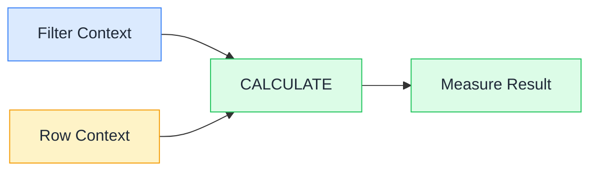

# 📊 DAX: Visual Edition

### Master DAX in minutes, not months.

**Simple visuals + everyday analogies that explain DAX to everyone, whether you're a business analyst or a developer who's never opened Power BI.**

*If this helps you finally "get" DAX, drop a ⭐. It helps more people find it.*

---

## 🤔 Why this exists

DAX has millions of Power BI users, and almost all of them hit the same wall: filter context vs row context trips everyone up. Most tutorials are either cryptic function references or 50-page textbooks. This repo explains it with a diagram and one analogy.

Every pattern gives you four things:

- 🧒 **A plain-English analogy**: so the concept clicks before you see a single formula
- 🖼️ **A diagram**: so the context flow is visible, not just described
- 🔧 **How it actually works**: the mechanics, explained like a smart friend over coffee
- 🌍 **A copy-paste example**: ready to drop into your model

---

## 🗺️ How DAX contexts relate

The two hardest concepts in DAX, and how CALCULATE bridges them:

Filter context comes from slicers, row headers, and CALCULATE. Row context comes from calculated columns and iterator functions. CALCULATE is the only thing that can modify filter context, and the only thing that can convert row context into filter context. Everything else flows from there.

---

## 📚 The Patterns

### 🌱 Start here: the foundations

| Pattern | One-liner |
|---------|-----------|
| [➕ SUM vs SUMX](patterns/sum-vs-sumx.md) | SUM adds up a column; SUMX loops through rows and adds up an expression |
| [🧮 CALCULATE](patterns/calculate.md) | The one function that changes which filters are active before evaluating an expression |
| [🔍 Filter Context](patterns/filter-context.md) | The invisible set of filters Power BI applies before your measure even starts calculating |
| [📏 Row Context](patterns/row-context.md) | The "current row" DAX is on when it's looping through a table |
| [🔗 RELATED](patterns/related.md) | Jump from the current row in one table to a value in a related dimension table |
| [⚖️ Measures vs Calculated Columns](patterns/measures-vs-calculated-columns.md) | Same DAX syntax, two completely different behaviors: one stored, one live |
| [📌 VAR / RETURN](patterns/variables.md) | Calculate something once, give it a name, use it as many times as you need |

### ⚙️ Time intelligence

| Pattern | One-liner |
|---------|-----------|
| [📅 TOTALYTD](patterns/totalytd.md) | The running total from the first day of the year to today's date |
| [⏩ DATEADD](patterns/dateadd.md) | Shift any date range forward or backward by days, months, quarters, or years |
| [📆 SAMEPERIODLASTYEAR](patterns/sameperiodlastyear.md) | The fastest year-over-year comparison in DAX: one function, done |
| [🗓️ DATESBETWEEN](patterns/datesbetween.md) | Return all dates between an explicit start and end: great for custom rolling windows |

### 🏗️ Advanced patterns

| Pattern | One-liner |
|---------|-----------|
| [🏆 RANKX](patterns/rankx.md) | Rank any item dynamically by any measure: updates automatically with every filter |
| [🔝 TOPN](patterns/topn.md) | Return a virtual table containing only the top N rows by any measure |
| [🎯 ALLSELECTED](patterns/allselected.md) | Remove slicer filters while still respecting filters set on the visual itself |
| [🔀 USERELATIONSHIP](patterns/userelationship.md) | Temporarily activate an inactive relationship inside a single measure |
| [🗄️ Virtual Tables](patterns/virtual-tables.md) | Tables built in memory by DAX functions: they exist during a calculation, then disappear |

### ⚠️ Gotchas: the traps

| Pattern | One-liner |
|---------|-----------|
| [🔄 Context Transition](patterns/context-transition.md) | The silent moment when CALCULATE converts your row context into an equivalent filter context |
| [🔁 Circular Dependencies](patterns/circular-dependencies.md) | When a calculated column references a column that references it back: Power BI refuses to save |
| [0️⃣ Blank vs Zero](patterns/blank-vs-zero.md) | BLANK means "no data existed." Zero means "data existed and it was zero." DAX treats them differently |

---

## 👯 Sister projects

- [AI for Beginners: Visual Edition](https://github.com/behnia137/ai-for-beginners-visual), neural networks, transformers, and LLMs explained with diagrams
- [Power BI Data Modeling: Visual Edition](https://github.com/behnia137/power-bi-data-modeling-visual), star schemas, relationships, and cardinality finally make sense

---

## 🤝 Contributing

See [CONTRIBUTING.md](CONTRIBUTING.md). New patterns are always welcome.

---

## 📄 License

[MIT](LICENSE)
