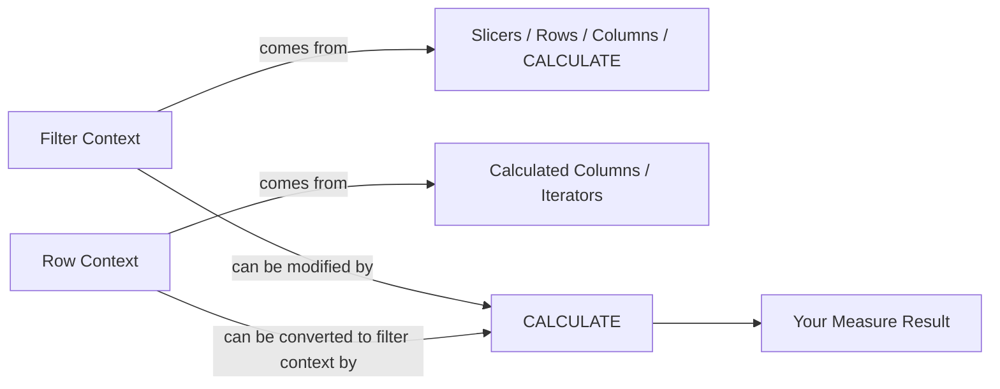
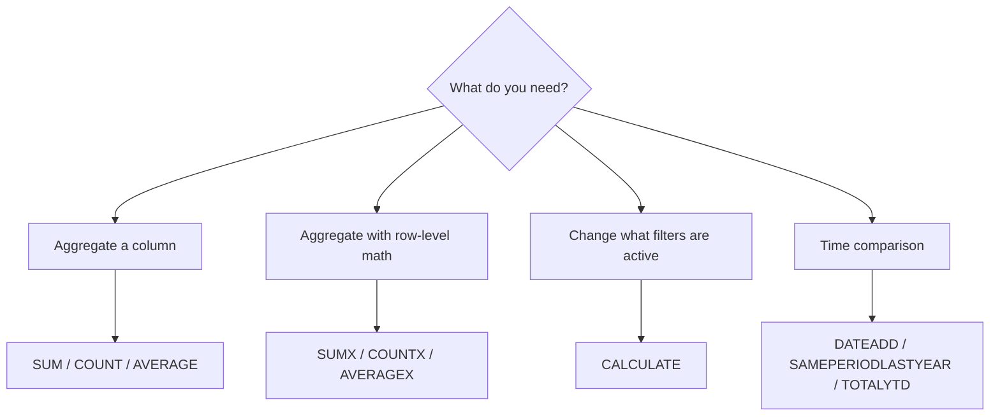

# DAX Visual Edition

> DAX demystified — filter context, row context, and CALCULATE finally make sense.

Every pattern follows the same three-layer format:
1. **ELI5 analogy** — a plain-English hook before any formula
2. **Mermaid diagram** — how context flows through the model
3. **Copy-paste pattern** — ready-to-use DAX with before/after table examples

---

## The #1 Thing You Need to Understand First

Filter context and row context are different things. Most DAX confusion comes from mixing them up. Every pattern in this repo is labeled with which context it operates in.

---

## Patterns by Tier

### Tier 1 — Foundations
| Pattern | One-liner |
|---------|-----------|
| [SUM vs SUMX](patterns/sum-vs-sumx.md) | Aggregation vs iteration — the most common beginner trap |
| [CALCULATE](patterns/calculate.md) | The most powerful function in DAX — modifies filter context |
| [Filter Context](patterns/filter-context.md) | What filters are active when your measure evaluates |
| [Row Context](patterns/row-context.md) | The current row when iterating through a table |
| [RELATED](patterns/related.md) | Lookup a value from a related table |
| [Measures vs Calculated Columns](patterns/measures-vs-calculated-columns.md) | Same syntax, completely different behavior |
| [VAR / RETURN](patterns/variables.md) | Evaluate once, reuse everywhere — faster and debuggable |

### Tier 2 — Time Intelligence
| Pattern | One-liner |
|---------|-----------|
| [TOTALYTD](patterns/totalytd.md) | Running total from the start of the year |
| [DATEADD](patterns/dateadd.md) | Compare this period to a prior period |
| [SAMEPERIODLASTYEAR](patterns/sameperiodlastyear.md) | Year-over-year comparison in one function |
| [DATESBETWEEN](patterns/datesbetween.md) | Aggregate over a custom date range |

### Tier 3 — Advanced Patterns
| Pattern | One-liner |
|---------|-----------|
| [RANKX](patterns/rankx.md) | Rank items dynamically across any dimension |
| [TOPN](patterns/topn.md) | Return the top N rows from a table |
| [ALLSELECTED](patterns/allselected.md) | Respect visual filters but ignore slicer context |
| [USERELATIONSHIP](patterns/userelationship.md) | Activate an inactive relationship on the fly |
| [Virtual Tables](patterns/virtual-tables.md) | FILTER, ADDCOLUMNS, SUMMARIZE — building tables in memory |

### Tier 4 — Context Transition & Gotchas
| Pattern | One-liner |
|---------|-----------|
| [Context Transition](patterns/context-transition.md) | When CALCULATE secretly converts row context to filter context |
| [Circular Dependencies](patterns/circular-dependencies.md) | Why your calculated column won't save |
| [Blank vs Zero](patterns/blank-vs-zero.md) | Why blanks behave differently from zeros in DAX |
| [Division Safety](patterns/division-safety.md) | DIVIDE vs the `/` operator — always use DIVIDE |

---

## Quick Reference: When to Use What

---

## Why this repo?

DAX has millions of Power BI users — and almost all of them hit the same wall: filter context vs row context. Books explain it with 50 pages of theory. This repo explains it with a diagram and one analogy.

**Not too simple. Not too academic. Just visual.**

---

## License

MIT
