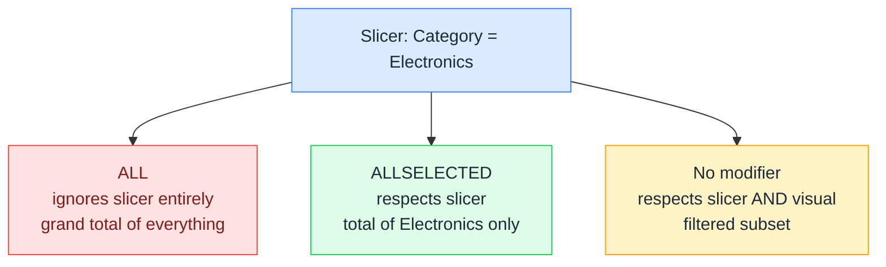

# 🎯 ALLSELECTED

> **🧒 Explain Like I'm 5:** It's a percentage-of-total that uses only the products currently visible in your table, not all products ever, but also not filtered down further by the visual itself.

## 🖼️ The Picture

ALLSELECTED sits between ALL (removes everything) and no modifier (keeps everything). It removes filters applied by the visual itself while preserving filters from slicers and external sources.

## 🔧 How it actually works

ALLSELECTED returns all values of a column (or all rows of a table) that were visible *before* the visual applied its own filters. In practice, this means: slicer selections are preserved, but row-level filters within the visual are removed. This makes it perfect for "percentage of subtotal" measures: you want the denominator to be "all the products currently showing in the visual," not the entire product catalog.

The mental model: imagine a report with a category slicer set to "Electronics" and a table showing individual products. If you use `ALL(DimProduct)`, the denominator includes every product in the entire model, so the percentage denominators will be tiny because Electronics is a small fraction of everything. If you use `ALLSELECTED(DimProduct)`, the denominator is just the Electronics products, so percentages add up to 100% within the visible set. That's almost always what users expect.

ALLSELECTED's behavior is technically defined as "restore the filter context that existed at the start of the most recent SUMMARIZECOLUMNS call," which is a mouthful. The practical implication: it respects what the user selected in slicers and cross-filters from other visuals, but ignores the row-by-row breakdown in the current visual. It is not a simple "remove visual filters" function, so test it carefully with complex filter interactions.

## 🌍 Real-world example

A product performance table shows individual products with a "% of category total" column. The user has a slicer that filters to just the Electronics category. With `CALCULATE([Total Sales], ALL(DimProduct[Product]))`, the denominator is all-time total sales, useless for showing share within Electronics. With `CALCULATE([Total Sales], ALLSELECTED(DimProduct[Product]))`, the denominator is just the Electronics products currently in the visual, so the percentages add up to 100% and make intuitive sense to the reader.

## 🔗 Related

- [🧮 CALCULATE](calculate.md)
- [🔍 Filter Context](filter-context.md)
- [🏆 RANKX](rankx.md)
