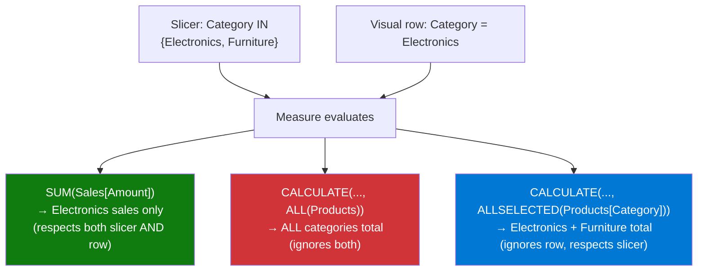

# ALLSELECTED

## ELI5

Imagine a bar chart filtered by a slicer to show only 3 out of 10 product categories. You want the percentage bars to add up to 100% *within those 3 categories*, not across all 10. ALLSELECTED gives you the total for "whatever the user has selected in the slicer" — it ignores the row/column header context but still honors the outer slicer.

It sits between ALL (ignores everything) and no function (respects everything).

## Visual — ALLSELECTED vs ALL vs no function



## Pattern

```dax
-- % of total that respects slicer but not visual row context
Sales % of Slicer Total = 
DIVIDE(
    SUM(Sales[Amount]),
    CALCULATE(SUM(Sales[Amount]), ALLSELECTED(Products[Category]))
)

-- % of total that ignores everything (benchmark against all data)
Sales % of Grand Total = 
DIVIDE(
    SUM(Sales[Amount]),
    CALCULATE(SUM(Sales[Amount]), ALL(Products))
)

-- Share within selected customers
Customer Share = 
DIVIDE(
    [Total Sales],
    CALCULATE([Total Sales], ALLSELECTED(Customers[CustomerName]))
)

-- ALLSELECTED on full table vs single column
-- Full table: removes all visual-level filters on the table
Sales % (All Dims) = 
DIVIDE(
    SUM(Sales[Amount]),
    CALCULATE(SUM(Sales[Amount]), ALLSELECTED())  -- no argument = all filters
)
```

## Before / After

| Slicer | Row | `SUM` | `ALL(Category)` | `ALLSELECTED(Category)` |
|--------|-----|-------|-----------------|------------------------|
| Elec + Furn | Electronics | $120k | $450k (all 10) | $205k (2 selected) |
| Elec + Furn | Furniture | $85k | $450k | $205k |
| Elec + Furn | Total | $205k | $450k | $205k |
| All categories | Electronics | $120k | $450k | $450k (all = selected) |

> When no slicer is active, ALLSELECTED behaves exactly like ALL.

## Key rules

- **ALLSELECTED respects outer query filters (slicers) but removes the current visual's row/column filters** — this is its key difference from ALL
- **Use ALLSELECTED for "% of visible total" scenarios** — so your percentages sum to 100% within the user's current selection
- **ALLSELECTED() with no argument removes all visual-level filters** — passing a specific column removes only that column's visual context
- **ALLSELECTED can produce unexpected results with complex filter interactions** — test with multiple overlapping slicers and cross-filters before deploying
- **ALLSELECTED shadows the shadow filter context** — it is implemented using DAX's shadow filter mechanism and can behave unexpectedly inside deeply nested CALCULATE calls; prefer it at the outermost measure level
