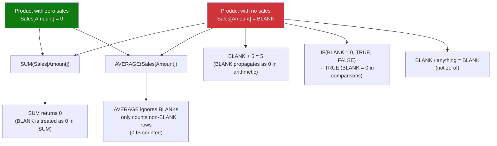

# Blank vs Zero

## ELI5

In most programming languages, "nothing" and "zero" mean the same thing. In DAX they are completely different. **BLANK** means "no data exists here" — like a cell that was never filled in. **Zero** means "data exists and it is zero." The difference matters because DAX treats BLANKs specially: they propagate silently, they're excluded from averages, and they can make your totals look different from what you expect.

Think of it like a survey: a blank response means "didn't answer." A zero means "answered zero." A zero answer affects the average; a blank doesn't.

## Visual — How BLANK propagates vs how zero behaves



## Pattern

```dax
-- BLANK() function explicitly returns a blank
No Sales Indicator = 
IF(SUM(Sales[Amount]) = 0, BLANK(), SUM(Sales[Amount]))
-- Use to hide zero rows from visuals (BLANK rows are excluded from charts)

-- Test for blank
Has Sales = 
IF(ISBLANK([Total Sales]), "No Data", "Has Data")

-- Return 0 instead of BLANK
Total Sales No Blank = 
IF(ISBLANK(SUM(Sales[Amount])), 0, SUM(Sales[Amount]))
-- Or simpler:
Total Sales No Blank = SUM(Sales[Amount]) + 0

-- COALESCE: return first non-blank value (DAX 2019+)
Safe Value = COALESCE([Total Sales], 0)

-- BLANK vs 0 in AVERAGE
-- Products table: Product A has $100 sales, Product B has no sales (BLANK)
Avg With Blank = AVERAGE(Sales[Amount])  -- only averages non-blank rows
Avg Treating Blank as Zero = 
AVERAGEX(
    Products,
    IF(ISBLANK([Total Sales]), 0, [Total Sales])  -- force zeros in
)

-- BLANK in division
Safe Division = DIVIDE([Numerator], [Denominator])
-- DIVIDE returns BLANK when denominator is 0 or BLANK (not an error)
-- 0 / 0 = BLANK (not error, not 0)
-- 5 / 0 = BLANK (not error)

-- Filter out blanks in a measure
Non Blank Count = 
COUNTROWS(
    FILTER(Products, NOT ISBLANK([Total Sales]))
)
```

## Before / After

| Product | Sales Rows | `SUM` | `AVERAGE` | `COUNTROWS` | `COALESCE(..., 0)` |
|---------|-----------|-------|-----------|-------------|-------------------|
| Laptop | 5 rows of $100 | $500 | $100 | 5 | $500 |
| Phone | No rows (BLANK) | BLANK | excluded | 0 | $0 |
| Tablet | 1 row of $0 | $0 | $0 | 1 | $0 |
| **Avg of above** | | | **$50** (only Laptop+Tablet) | | |

> Phone (BLANK) is excluded from AVERAGE. Tablet ($0) is included. That's the critical difference.

## Key rules

- **BLANK and 0 are equal in comparisons** — `IF(BLANK() = 0, ...)` returns TRUE; use ISBLANK() to distinguish them explicitly
- **BLANK propagates through arithmetic** — `BLANK() + 5 = 5`, but `BLANK() / 5 = BLANK()` (not 0); division by zero via DIVIDE returns BLANK, not an error
- **AVERAGE, AVERAGEX, and statistical functions skip BLANK rows** — they are not counted in the denominator; explicitly convert BLANKs to 0 with COALESCE if you want them included
- **Returning BLANK() from a measure hides the row/cell in Power BI visuals** — this is useful to suppress zero-value rows; returning 0 keeps them visible
- **SUM and SUMX treat BLANK as 0** — `SUM` of a column with 3 BLANKs and 2 values of $100 returns $200, not an error
