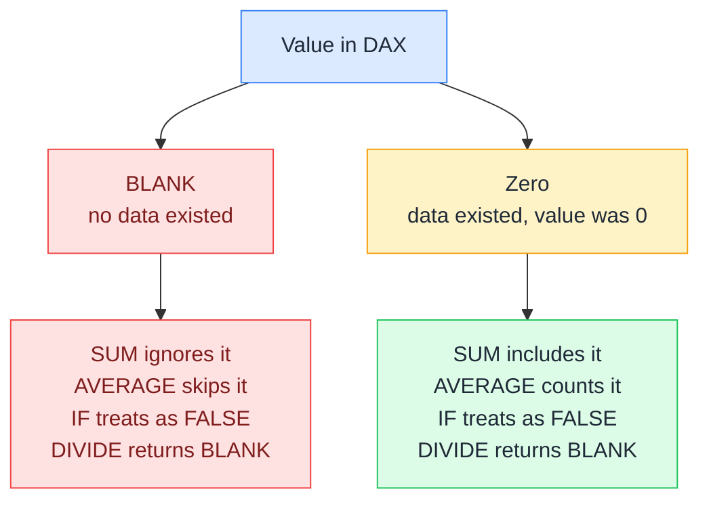

# 0️⃣ Blank vs Zero

> **🧒 Explain Like I'm 5:** An empty seat (BLANK: no ticket was ever sold) looks the same as a seat with a free ticket (Zero: it was comped). Both look empty, but they mean completely different things.

## 🖼️ The Picture

BLANK and Zero look identical in most visuals, but behave differently inside DAX functions. The difference matters most in averages and conditionals.

## 🔧 How it actually works

BLANK in DAX is not zero and not null: it's its own thing. It propagates through arithmetic: `BLANK() + 5 = 5`, `BLANK() * 5 = BLANK()`, and `BLANK() = 0` evaluates to TRUE in a comparison (which is one of the most surprising behaviors in the language). This last point means that `IF(SomeColumn = 0, "zero", "nonzero")` returns "zero" for both zero values and blank values, which is often not what you want.

AVERAGE is the most common place this distinction bites people. `AVERAGE` skips BLANK values entirely: it divides the sum by the count of non-blank rows. `AVERAGE` of {1, BLANK, 3} is 2, not 1.33. If you replace the BLANK with a 0, the average drops to 1.33. Whether that's correct depends on what the blank represents: "no sale happened" (ignore it) vs "a sale happened for zero dollars" (include it).

DIVIDE deserves special mention: `DIVIDE(x, 0)` returns BLANK by default, while `x / 0` throws a division by zero error. This is why DAX best practice is always use DIVIDE for division: it handles the zero-denominator case gracefully and returns BLANK instead of crashing the visual. You can pass a third argument to DIVIDE to return a custom value instead of BLANK.

## 🌍 Real-world example

A sales dashboard shows average order value by salesperson. A salesperson who made no sales in a period has BLANK for that period, so AVERAGE ignores them entirely, keeping their "average" from dragging down team numbers. A different salesperson who processed a $0 returns/refund order has Zero, and that zero is counted in their average, correctly lowering it. When the business analyst first sees this, they think there's a bug. There isn't. The distinction between "no orders" and "a $0 order" is real, and DAX honors it.

## 🔗 Related

- [⚖️ Measures vs Calculated Columns](measures-vs-calculated-columns.md)
- [🧮 CALCULATE](calculate.md)
- [🔍 Filter Context](filter-context.md)
