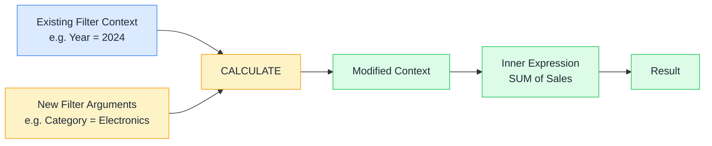

# 🧮 CALCULATE

> **🧒 Explain Like I'm 5:** You're looking at sales through a window that only shows this year's Electronics — CALCULATE lets you swap that window for any view you want, just for the duration of one calculation.

## 🖼️ The Picture



CALCULATE merges the existing context with your filter arguments, hands the blended result to the inner expression, and returns whatever that expression produces.

## 🔧 How it actually works

CALCULATE is the most powerful function in DAX — not because of what it calculates, but because of what it *changes*. Its first argument is any expression (usually a measure). Every argument after that is a filter. CALCULATE takes the current filter context, overlays your filters on top, and evaluates the expression inside that modified context.

When you pass a condition like `Products[Category] = "Electronics"`, CALCULATE *replaces* any existing filter on that column with the new one. That's different from adding to it — if the report already filtered to Furniture and you write `CALCULATE([Sales], Products[Category] = "Electronics")`, you get Electronics, not nothing. Your filter wins. To *add* a filter without replacing, use KEEPFILTERS.

CALCULATE also does something invisible and important: it triggers **context transition**. Any time CALCULATE runs inside an iterator (like SUMX or FILTER), it converts the current row context into an equivalent filter context. This is what makes measures inside iterators behave correctly — and what causes the most confusing bugs when you don't expect it.

## 🌍 Real-world example

You want a "% of total" measure that shows each category's share of all sales, regardless of what the user selects in a slicer. You write `Sales % of Total = DIVIDE([Total Sales], CALCULATE([Total Sales], ALL(Products[Category])))`. The `ALL(Products[Category])` strips the category filter, so the denominator always represents everything. The Year slicer still applies — ALL only removes what you tell it to remove.

```dax
-- Override a single filter
Electronics Sales =
CALCULATE(
    SUM(Sales[Amount]),
    Products[Category] = "Electronics"
)

-- Remove a filter entirely
All-Category Sales =
CALCULATE(
    SUM(Sales[Amount]),
    ALL(Products[Category])
)

-- Stack multiple filter arguments (they are AND'd together)
Electronics 2024 =
CALCULATE(
    SUM(Sales[Amount]),
    Products[Category] = "Electronics",
    'Date'[Year] = 2024
)
```

## 🔗 Related

- [🔍 Filter Context](filter-context.md)
- [🔄 Context Transition](context-transition.md)
- [🎯 ALLSELECTED](allselected.md)
