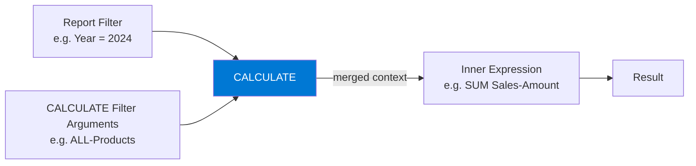

# CALCULATE

## ELI5

Imagine you're looking at sales numbers through a window. By default, the window shows you sales for the city your report is filtered to. CALCULATE lets you temporarily swap that window — "show me sales for the whole country, even though the report says Paris."

CALCULATE doesn't change the number itself. It changes what filters are active *before* the number gets calculated.

## Visual — How CALCULATE modifies filter context



CALCULATE takes the existing filter context, applies your filter arguments (which can add, replace, or remove filters), and hands the modified context to the inner expression.

## Pattern

```dax
-- Basic: filter a measure to a specific category
Electronics Sales = 
CALCULATE(
    SUM(Sales[Amount]),
    Products[Category] = "Electronics"
)

-- Remove all filters on a column
All Products Sales = 
CALCULATE(
    SUM(Sales[Amount]),
    ALL(Products)
)

-- Combine filters
Electronics 2024 Sales = 
CALCULATE(
    SUM(Sales[Amount]),
    Products[Category] = "Electronics",
    'Date'[Year] = 2024
)
```

## Before / After

| Report context | Without CALCULATE | With CALCULATE + ALL(Products) |
|----------------|-------------------|-------------------------------|
| Category = Electronics | $120,000 | $120,000 |
| Category = Furniture | $85,000 | $205,000 (all categories) |
| No filter | $205,000 | $205,000 |

## Key rules

1. **Filter arguments are AND'd together** — each argument further narrows (or replaces) the context
2. **CALCULATE triggers context transition** — when used inside an iterator, it converts row context to filter context
3. **ALL() removes filters; FILTER() adds them** — know which direction you're going
4. **Never nest CALCULATE inside CALCULATE** — the outer one wins and the inner one is redundant
