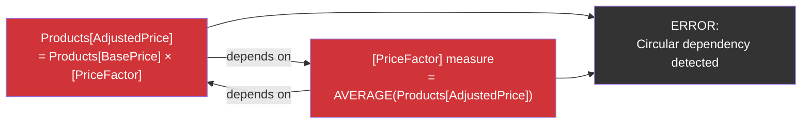

# Circular Dependencies

## ELI5

A circular dependency is like two students who each say "I'll copy my answer from you" — neither ever writes anything down, and the teacher gets nothing. In DAX, it happens when a calculated column or table tries to use a value that itself depends on the first column to exist. The engine can't figure out which one to compute first, so it throws an error.

## Visual — How a circular dependency forms



Circular dependencies most commonly occur between calculated columns and measures that reference those columns, or between two calculated columns that reference each other.

## Pattern

```dax
-- CAUSES circular dependency:
-- Calculated column references a measure that aggregates the same column
Products[AdjustedPrice] = Products[BasePrice] * [AvgPriceFactor]
-- Where [AvgPriceFactor] = AVERAGE(Products[AdjustedPrice])  ← circular!

-- -------------------------------------------------------
-- FIX 1: Replace the measure with a direct column reference
Products[AdjustedPrice] = 
Products[BasePrice] * Products[PriceFactorCol]  -- use stored column, not measure

-- -------------------------------------------------------
-- FIX 2: Break the chain by computing intermediate values differently
-- Compute the factor at measure time, not column time
Adjusted Revenue = 
SUMX(
    Products,
    Products[BasePrice] * [AvgPriceFactorFromOtherTable]
)

-- -------------------------------------------------------
-- Common circular dependency: two columns referencing each other
-- BAD:
Sales[GrossMargin] = Sales[Revenue] - Sales[Cost]  -- fine
Sales[MarginPct] = Sales[GrossMargin] / Sales[Revenue]  -- fine

-- BAD circular version:
Sales[Revenue] = Sales[Quantity] * RELATED(Products[Price]) + Sales[Bonus]
Sales[Bonus] = Sales[Revenue] * 0.05   -- ← circular! Bonus depends on Revenue
                                        --   Revenue depends on Bonus

-- FIX: compute Bonus from a base price, not from Revenue
Sales[Bonus] = Sales[Quantity] * RELATED(Products[Price]) * 0.05
Sales[Revenue] = Sales[Quantity] * RELATED(Products[Price]) * 1.05

-- -------------------------------------------------------
-- Calculated TABLE circular dependency
-- BAD:
ProductSummary = SUMMARIZE(Sales, Products[Category], "AvgPrice", AVERAGE(Products[AdjustedPrice]))
-- If AdjustedPrice depends on a measure that reads ProductSummary → circular

-- FIX: base calculated tables only on physical columns, not derived measures
ProductSummary = SUMMARIZE(Sales, Products[Category], "AvgPrice", AVERAGE(Products[BasePrice]))
```

## Before / After

| Situation | What DAX does | Fix |
|-----------|--------------|-----|
| Column A → Measure → Column A | Circular dependency error, column won't save | Break the loop: make the measure use a different source column |
| Column A → Column B → Column A | Circular dependency error | Reorder logic so one column is computed from physical columns only |
| Measure → Measure → Measure | No error (measures are lazy-evaluated at query time) | Not a problem; measures can reference each other freely |
| Calculated Table → Measure → Calculated Table | Circular dependency error | Base calculated tables on physical tables/columns only |

## Key rules

- **Measures can reference each other freely** — circular dependencies only affect calculated columns and calculated tables, which must be computed at refresh time in a fixed order
- **The root cause is always a refresh-time ordering problem** — DAX needs to know "compute X before Y," but a cycle makes that impossible
- **Trace the dependency chain** — when you get the error, follow each reference until you find where the loop closes; the Power BI error message usually names both columns involved
- **Calculated tables that depend on measures are high-risk** — if the measure eventually reads a column from that calculated table, you have a cycle; prefer basing calculated tables on raw physical columns
- **Moving logic from a calculated column into a measure breaks the cycle** — measures are query-time constructs; they don't need a refresh-time order and thus can't create circular dependencies with each other
