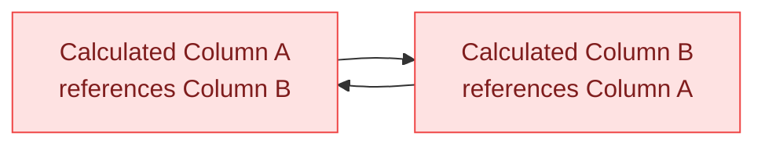

# 🔁 Circular Dependencies

> **🧒 Explain Like I'm 5:** "When does the meeting start?" — "When the other meeting ends." — "When does that one end?" — "When the first meeting starts." Nobody can leave — and Power BI feels the same way.

## 🖼️ The Picture

Power BI detects the loop before saving — the model refuses to publish with a circular dependency. You'll see an error, not wrong results.

## 🔧 How it actually works

A circular dependency occurs when a calculated column (or calculated table) references another calculated column that — directly or through a chain — references the first one back. DAX can't resolve this because it has no starting point: to compute A, it needs B, but to compute B, it needs A. Power BI detects these cycles during model validation and blocks the save entirely.

The most common cause is two calculated columns that both try to reference each other's values, or a chain of three or more columns that forms a loop. Circular dependencies can also appear between calculated tables — Table A defined using Table B, and Table B defined using Table A. The error message in Power BI Desktop usually names the columns involved, which helps you trace the cycle.

Measures are immune to circular dependencies in the traditional sense because they don't store their values — they're computed on demand. You can have a measure that references another measure that references it back without a build error, though you'd get an infinite evaluation loop at query time, which DAX will catch and return blank for. In practice, genuinely circular measure logic is rare; the error you actually care about is the calculated column version that blocks model deployment.

## 🌍 Real-world example

A developer creates two calculated columns on `FactSales`: `AdjustedPrice = FactSales[BasePrice] * FactSales[Multiplier]` and `Multiplier = IF(FactSales[AdjustedPrice] > 100, 1.1, 1.0)`. This looks logical in isolation — Multiplier depends on whether AdjustedPrice exceeds a threshold, and AdjustedPrice uses Multiplier. But Power BI immediately flags a circular dependency: computing AdjustedPrice requires Multiplier, and computing Multiplier requires AdjustedPrice. The fix is to remove the dependency: precompute Multiplier from a base column that doesn't reference AdjustedPrice, or move the logic into a measure evaluated at query time.

## 🔗 Related

- [⚖️ Measures vs Calculated Columns](measures-vs-calculated-columns.md)
- [📏 Row Context](row-context.md)
- [🗄️ Virtual Tables](virtual-tables.md)
