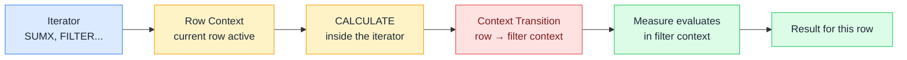

# 🔄 Context Transition

> **🧒 Explain Like I'm 5:** You're reading a row on a conveyor belt (row context). The moment you call CALCULATE, someone takes a photo of that row and pins it to the wall as a filter — now you're in filter mode instead of row mode.

## 🖼️ The Picture

Context transition is automatic and invisible — it happens any time CALCULATE (or any measure, which implicitly wraps itself in CALCULATE) is called inside row context.

## 🔧 How it actually works

When CALCULATE runs inside a row context — typically inside an iterator like SUMX or FILTER — it does something extra before evaluating its inner expression. It takes every column value from the current row and converts them into an equivalent set of filter context constraints. If the current row has `ProductKey = 42`, context transition adds a filter `DimProduct[ProductKey] = 42` to the filter context. The row context is then replaced by this derived filter context.

This matters because measures are always evaluated in filter context, never in row context. When you call a measure inside SUMX — even without CALCULATE explicitly — the measure is wrapped in an implicit CALCULATE, which triggers context transition. This is why measures called from iterators "know" which row they're on: context transition converted the row into a filter.

The gotcha: context transition can produce unexpected results when the current row's key column is not unique. If two rows have the same key value, context transition creates a filter that matches both rows — your measure evaluates over two rows instead of one. This is the most common source of "my SUMX returns double the expected value" bugs.

## 🌍 Real-world example

A developer writes a calculated column `Sales Rank = RANKX(ALL(FactSales), [Total Sales])`. They expect each row's rank based on that row's sales amount. But `[Total Sales]` is a measure — calling it inside RANKX's iterator triggers context transition. For each row in the iterator, DAX converts the row's key values into a filter context, then evaluates `[Total Sales]` against that filtered context. The rank is computed correctly because context transition makes the measure "see" only that row's data. Without context transition, the measure would return the same grand total for every row.

## 🔗 Related

- [📏 Row Context](row-context.md)
- [🔍 Filter Context](filter-context.md)
- [🧮 CALCULATE](calculate.md)
