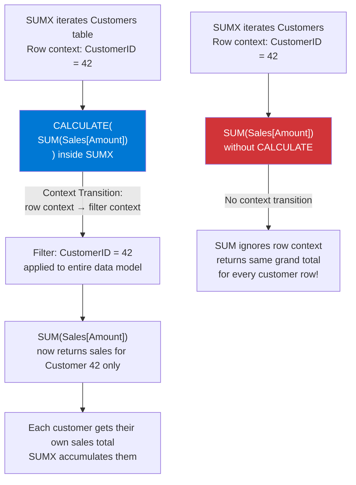

# Context Transition

## ELI5

Context transition is DAX's most surprising behavior. Normally, measures and calculated columns live in completely separate worlds. But when you call **CALCULATE inside an iterator** (like SUMX or FILTER), something magic — and dangerous — happens: the current **row context** is silently converted into an equivalent **filter context** before the expression inside CALCULATE runs.

It's like the iterator row says "I am Product ID 101" and CALCULATE translates that into a filter: "only show data where Product ID = 101." Useful when you want it. Catastrophic when you don't.

## Visual — Context transition in action



## Pattern

```dax
-- WRONG: SUM inside SUMX without CALCULATE — ignores row context
-- Returns grand total × number of rows (massively inflated)
WRONG Total = 
SUMX(
    Customers,
    SUM(Sales[Amount])    -- SUM doesn't see row context!
)

-- CORRECT: reference the column directly in the iterator
Correct Total = 
SUMX(
    Sales,
    Sales[Amount]         -- direct column reference uses row context correctly
)

-- Context transition: CALCULATE inside SUMX triggers it
-- This correctly computes each customer's sales using their own filter
Customer Weighted Score = 
SUMX(
    Customers,
    CALCULATE(SUM(Sales[Amount])) * Customers[PriorityWeight]
    -- CALCULATE triggers context transition:
    -- each iteration filters Sales to the current customer
)

-- Calling a measure inside an iterator triggers context transition implicitly
-- (measures always have an implicit CALCULATE wrapper)
Sum of Measure = 
SUMX(
    Customers,
    [Total Sales]   -- [Total Sales] = SUM(Sales[Amount])
                    -- calling a measure here triggers context transition!
)

-- Calculated column: context transition when calling a measure
-- This calculated column on the Customers table works correctly:
Customers[TotalSales] = [Total Sales]
-- Equivalent to:
Customers[TotalSales] = CALCULATE(SUM(Sales[Amount]))
-- Because calling a measure in a calculated column triggers context transition
```

## Before / After

| Scenario | Code | CustomerID 42 Sales | Behavior |
|----------|------|---------------------|----------|
| Direct reference | `SUMX(Sales, Sales[Amount])` | N/A | Correct aggregation |
| SUM without CALCULATE | `SUMX(Customers, SUM(Sales[Amount]))` | $2,450,000 (grand total) | Wrong — repeats grand total |
| Measure call (implicit CT) | `SUMX(Customers, [Total Sales])` | $8,400 | Correct — CT activates |
| Explicit CALCULATE | `SUMX(Customers, CALCULATE(SUM(Sales[Amount])))` | $8,400 | Correct — CT explicit |

## Key rules

- **Calling any measure inside an iterator triggers context transition** — measures have an implicit CALCULATE wrapper; this is intentional behavior
- **SUM, COUNT, and other aggregation functions do NOT trigger context transition** — only CALCULATE (explicit or implicit via measure call) does
- **Context transition can cause performance problems** — it forces a full filter context re-evaluation for every row in the iterator; on large tables this is expensive
- **Calculated column that calls a measure works via context transition** — `Column = [MyMeasure]` on a Customers table correctly returns each customer's measure value because the row context transitions to a filter
- **Unintentional context transition is a common silent bug** — if a measure returns the same value for every row in an iterator, check whether you're missing CALCULATE or calling an aggregation that ignores row context
