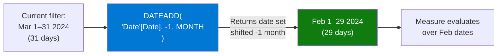

# DATEADD

## ELI5

DATEADD is a time machine for your date filter. Whatever date range is currently visible in your report, DATEADD shifts that entire window backward or forward by a fixed interval — a day, a month, a quarter, or a year. The shape of the window stays the same; only its position in time changes.

If your report is showing March 2024, `DATEADD(..., -1, MONTH)` gives you February 2024. Same number of days, just one month earlier.

## Visual — DATEADD shifts the date window



The shifted date set is then used as a filter context override inside CALCULATE.

## Pattern

```dax
-- Sales for the same period one year ago
Sales PY = 
CALCULATE(
    SUM(Sales[Amount]),
    DATEADD('Date'[Date], -1, YEAR)
)

-- Sales for the same period one month ago
Sales PM = 
CALCULATE(
    SUM(Sales[Amount]),
    DATEADD('Date'[Date], -1, MONTH)
)

-- Sales for same period one quarter ago
Sales PQ = 
CALCULATE(
    SUM(Sales[Amount]),
    DATEADD('Date'[Date], -1, QUARTER)
)

-- Year-over-year growth percentage
YoY Growth % = 
VAR CurrentSales = SUM(Sales[Amount])
VAR PriorYearSales = 
    CALCULATE(
        SUM(Sales[Amount]),
        DATEADD('Date'[Date], -1, YEAR)
    )
RETURN
    DIVIDE(CurrentSales - PriorYearSales, PriorYearSales)

-- Forward shift: forecast comparison (current vs 1 year ahead projection)
Sales NY = 
CALCULATE(
    SUM(Sales[Amount]),
    DATEADD('Date'[Date], 1, YEAR)
)
```

## Before / After

| Month | Current Sales | Sales PY (`DATEADD -1 YEAR`) | YoY Growth % |
|-------|--------------|------------------------------|--------------|
| Mar 2024 | $105,000 | $92,000 | +14.1% |
| Apr 2024 | $98,000 | $87,000 | +12.6% |
| May 2024 | $112,000 | $95,000 | +17.9% |

## Key rules

- **Requires a contiguous, marked Date table** — gaps in the Date table produce incorrect shifted ranges
- **DATEADD shifts the entire current date range, not just the last date** — if you have a YTD range Jan–Mar, `DATEADD(-1, YEAR)` returns Jan–Mar of last year (not just March)
- **Use SAMEPERIODLASTYEAR as a simpler alias for `DATEADD(-1, YEAR)`** — they are equivalent; SAMEPERIODLASTYEAR is more readable for year comparisons
- **Negative intervals go backward, positive go forward** — `DATEADD(..., -1, MONTH)` is prior month; `DATEADD(..., 1, MONTH)` is next month
- **DATEADD does not work with DAY interval on partial months** — if the current period is Feb (28 days) and you shift by MONTH, DAX aligns to calendar months correctly; but shifting by DAY gives exactly N days back regardless of calendar boundaries
