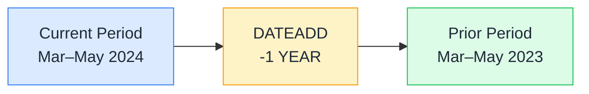

# ⏩ DATEADD

> **🧒 Explain Like I'm 5:** DATEADD is a time machine dial — turn it back 1 year and you get last year's data for the exact same period, same shape, same length.

## 🖼️ The Picture



The shape and length of the date range are preserved exactly — DATEADD just shifts the whole window forward or backward by the amount you specify.

## 🔧 How it actually works

DATEADD takes three arguments: a column of dates, a number (positive or negative), and an interval — DAY, MONTH, QUARTER, or YEAR. It returns a table of dates shifted by that amount. When you wrap it in CALCULATE, you're replacing the current date filter with the shifted set, which means your measure evaluates against the prior (or future) period's data.

The shift is aligned to the *same relative position* in the interval. DATEADD(-1, YEAR) on March 15 returns March 15 of the prior year — not 365 days back (which would land on March 14 in a leap year). This alignment makes year-over-year comparisons clean even across leap years and months with different lengths.

DATEADD is the most flexible time intelligence function. SAMEPERIODLASTYEAR is just `DATEADD('Date'[Date], -1, YEAR)` — it's a convenience wrapper. DATEADD is worth learning first because once you understand it, every other time intelligence function is a variation on the same theme.

## 🌍 Real-world example

A sales team compares weekly performance against the same week last year. They write `Sales LW = CALCULATE([Total Sales], DATEADD('Date'[Date], -7, DAY))` for last week, and `Sales LY Same Period = CALCULATE([Total Sales], DATEADD('Date'[Date], -1, YEAR))` for the same week last year. Both measures work automatically with whatever date range is selected in the slicer — no hardcoded dates, no table parameters, no maintenance when the year changes.

```dax
-- Prior year
Sales PY = CALCULATE([Total Sales], DATEADD('Date'[Date], -1, YEAR))

-- Prior quarter
Sales PQ = CALCULATE([Total Sales], DATEADD('Date'[Date], -1, QUARTER))

-- Prior month
Sales PM = CALCULATE([Total Sales], DATEADD('Date'[Date], -1, MONTH))

-- Next period (positive offset)
Sales Next Month = CALCULATE([Total Sales], DATEADD('Date'[Date], 1, MONTH))
```

## 🔗 Related

- [📆 SAMEPERIODLASTYEAR](sameperiodlastyear.md)
- [📅 TOTALYTD](totalytd.md)
- [🗓️ DATESBETWEEN](datesbetween.md)
