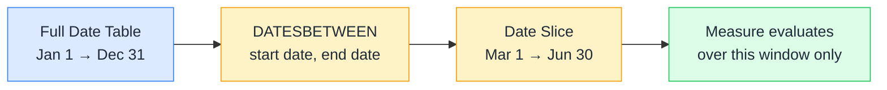

# 🗓️ DATESBETWEEN

> **🧒 Explain Like I'm 5:** You tell DAX "give me every day between March 1st and June 30th" — you set both fences, and DATESBETWEEN hands back exactly that slice of the calendar.

## 🖼️ The Picture

DATESBETWEEN cuts a precise slice out of the date table. Both boundaries are inclusive — the start date and end date are included in the result.

## 🔧 How it actually works

DATESBETWEEN takes three arguments: the date column, a start date, and an end date. Both dates can be literals, variable references, or expressions — commonly MIN and MAX of the date column combined with DATEADD or other functions. It returns a single-column table of dates, which is then used by CALCULATE to replace the current date filter.

Unlike DATESYTD, TOTALYTD, and SAMEPERIODLASTYEAR — which are all anchored to calendar conventions — DATESBETWEEN gives you full control. This makes it perfect for custom rolling windows: last 30 days, last 13 weeks, a custom fiscal quarter that doesn't align with the calendar, or any arbitrary range the business defines.

The most common pattern is using DATESBETWEEN with dynamic start/end dates derived from the current filter context. For example, `DATESBETWEEN('Date'[Date], DATEADD(MAX('Date'[Date]), -29, DAY), MAX('Date'[Date]))` builds a rolling 30-day window that moves with whatever end date is currently selected.

## 🌍 Real-world example

A logistics company tracks on-time delivery using a custom "performance window" — every Monday they look at the 28 days ending the previous Sunday. Standard time intelligence functions can't express this cleanly because the window doesn't align with months or years. They write `Delivery Rate (28d) = CALCULATE([On-Time Rate], DATESBETWEEN('Date'[Date], [PeriodStart], [PeriodEnd]))` where `PeriodStart` and `PeriodEnd` are measures that compute the correct Monday-to-Sunday boundaries. DATESBETWEEN makes the arbitrary window explicit and easy to audit.

## 🔗 Related

- [⏩ DATEADD](dateadd.md)
- [📅 TOTALYTD](totalytd.md)
- [🗄️ Virtual Tables](virtual-tables.md)
