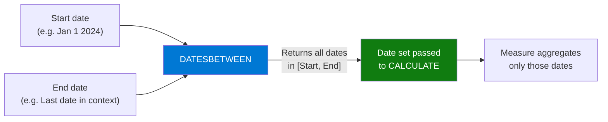

# DATESBETWEEN

## ELI5

Imagine you want to add up sales for a very specific custom period — say, the last 90 days before the selected date, or from the company's founding date to today. DATESBETWEEN is a pair of scissors: you tell it the exact start date and end date, and it cuts out that slice of the calendar for your measure to aggregate over.

Unlike TOTALYTD or SAMEPERIODLASTYEAR (which derive their range from the current context), DATESBETWEEN takes explicit start and end boundaries you define.

## Visual — DATESBETWEEN defines an explicit date range



DATESBETWEEN is typically used inside CALCULATE as a filter argument, replacing the current date context with your custom range.

## Pattern

```dax
-- Custom range: specific hardcoded dates (useful for testing)
Sales Jan 2024 = 
CALCULATE(
    SUM(Sales[Amount]),
    DATESBETWEEN('Date'[Date], DATE(2024,1,1), DATE(2024,1,31))
)

-- Rolling 30 days ending at the last date in context
Sales Last 30 Days = 
CALCULATE(
    SUM(Sales[Amount]),
    DATESBETWEEN(
        'Date'[Date],
        MAX('Date'[Date]) - 29,  -- 30 days inclusive
        MAX('Date'[Date])
    )
)

-- Rolling 90 days
Sales Last 90 Days = 
CALCULATE(
    SUM(Sales[Amount]),
    DATESBETWEEN(
        'Date'[Date],
        MAX('Date'[Date]) - 89,
        MAX('Date'[Date])
    )
)

-- From a fixed start date to the current context end
Sales Since Launch = 
CALCULATE(
    SUM(Sales[Amount]),
    DATESBETWEEN(
        'Date'[Date],
        DATE(2020, 6, 1),    -- product launch date
        MAX('Date'[Date])
    )
)

-- Month-to-date using DATESBETWEEN manually
Sales MTD Manual = 
CALCULATE(
    SUM(Sales[Amount]),
    DATESBETWEEN(
        'Date'[Date],
        DATE(YEAR(MAX('Date'[Date])), MONTH(MAX('Date'[Date])), 1),
        MAX('Date'[Date])
    )
)
```

## Before / After

| Context Date | `SUM(Sales[Amount])` (current month) | `DATESBETWEEN` Last 30 Days | `DATESBETWEEN` Last 90 Days |
|-------------|--------------------------------------|----------------------------|-----------------------------|
| Mar 31 2024 | $105,000 (March only) | $201,000 | $308,000 |
| Apr 15 2024 | $52,000 (Apr 1–15) | $183,000 | $310,000 |
| Jun 30 2024 | $118,000 (June only) | $234,000 | $325,000 |

> Rolling windows (last 30/90 days) don't align to calendar month boundaries — they trail the selected date continuously.

## Key rules

- **Both start and end dates are inclusive** — `DATESBETWEEN(Date, DATE(2024,1,1), DATE(2024,1,31))` includes both January 1 and January 31
- **End date before start date returns an empty table** — resulting in BLANK, not an error; guard with IF or DIVIDE where needed
- **Use MAX('Date'[Date]) to anchor to the current context** — this keeps rolling windows dynamic as slicers change
- **DATESBETWEEN replaces the date filter in context** — it does not intersect with it; the current date slicer is overridden inside the CALCULATE
- **For simple YTD/MTD/QTD, prefer DATESYTD/DATESMTD/DATESQTD** — those are cleaner and less error-prone; reserve DATESBETWEEN for truly custom ranges that don't align to calendar boundaries
