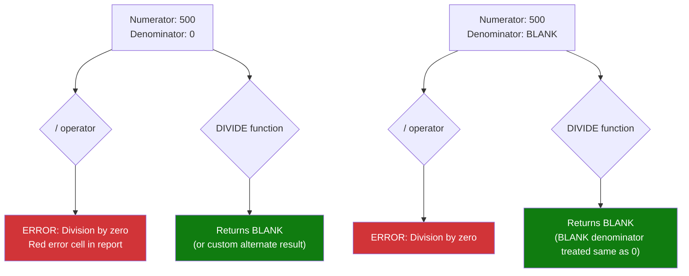

# Division Safety

## ELI5

In math class, dividing by zero is undefined — your calculator shows an error. In Power BI, dividing by zero with the `/` operator crashes your measure with a division-by-zero error, which shows up as a red error cell in your report. **DIVIDE** is the safe version: it catches the divide-by-zero situation and returns BLANK (or a custom fallback value) instead of crashing.

Always use DIVIDE instead of `/`. There is no downside and it eliminates an entire class of errors.

## Visual — How DIVIDE handles the zero/blank denominator



## Pattern

```dax
-- NEVER use / for division in measures
Unsafe Margin % = Sales[Revenue] / Sales[Cost]   -- crashes when Cost = 0

-- ALWAYS use DIVIDE
Safe Margin % = DIVIDE(Sales[Revenue], Sales[Cost])
-- Returns BLANK when Cost is 0 or BLANK

-- DIVIDE with custom alternate result (3rd argument)
Margin % with Fallback = 
DIVIDE(
    SUM(Sales[Revenue]) - SUM(Sales[Cost]),
    SUM(Sales[Revenue]),
    0                          -- return 0 instead of BLANK when denominator = 0
)

-- Common patterns
Conversion Rate = DIVIDE([Orders], [Visits])             -- BLANK if no visits
Avg Order Value = DIVIDE([Total Revenue], [Order Count]) -- BLANK if no orders
Market Share % = DIVIDE([My Sales], [Total Market Sales])

-- Percentage of total (safe)
Category Share = 
DIVIDE(
    SUM(Sales[Amount]),
    CALCULATE(SUM(Sales[Amount]), ALL(Products[Category]))
)

-- YoY growth % (safe)
YoY Growth % = 
DIVIDE(
    SUM(Sales[Amount]) - [Sales PY],
    [Sales PY]
    -- No fallback = returns BLANK when prior year has no data
    -- This is usually correct: don't show "infinite growth" for new products
)

-- When to use the fallback (3rd argument):
-- Use 0 when BLANK would break a cumulative or aggregated measure
Running Total = 
SUMX(
    FILTER('Date', 'Date'[Date] <= MAX('Date'[Date])),
    DIVIDE([Daily Sales], DIVIDE([Daily Sales], 1), 0)  -- illustrative
)
```

## Before / After

| Numerator | Denominator | `n / d` (unsafe) | `DIVIDE(n, d)` | `DIVIDE(n, d, 0)` |
|-----------|-------------|-----------------|----------------|-------------------|
| 500 | 100 | 5 | 5 | 5 |
| 500 | 0 | ERROR | BLANK | 0 |
| 500 | BLANK | ERROR | BLANK | 0 |
| 0 | 100 | 0 | 0 | 0 |
| BLANK | 100 | BLANK | BLANK | BLANK |
| 0 | 0 | ERROR | BLANK | 0 |

## Key rules

- **Always use DIVIDE instead of `/` in measures** — DIVIDE handles zero and BLANK denominators gracefully; `/` throws a runtime error
- **DIVIDE returns BLANK by default when denominator is 0 or BLANK** — this hides the cell in visuals, which is usually the right behavior for "no data" situations
- **Use the 3rd argument (alternate result) when BLANK would cascade into another calculation** — e.g., if the result feeds into a SUM or conditional expression where BLANK would cause incorrect totals
- **DIVIDE is slightly slower than `/` but the difference is negligible** — never skip DIVIDE for performance reasons; the safety benefit always outweighs the micro-overhead
- **DIVIDE does not validate that inputs are numeric** — passing a text column to DIVIDE will still error; use ISNUMBER() or proper data types to guard against type mismatches
