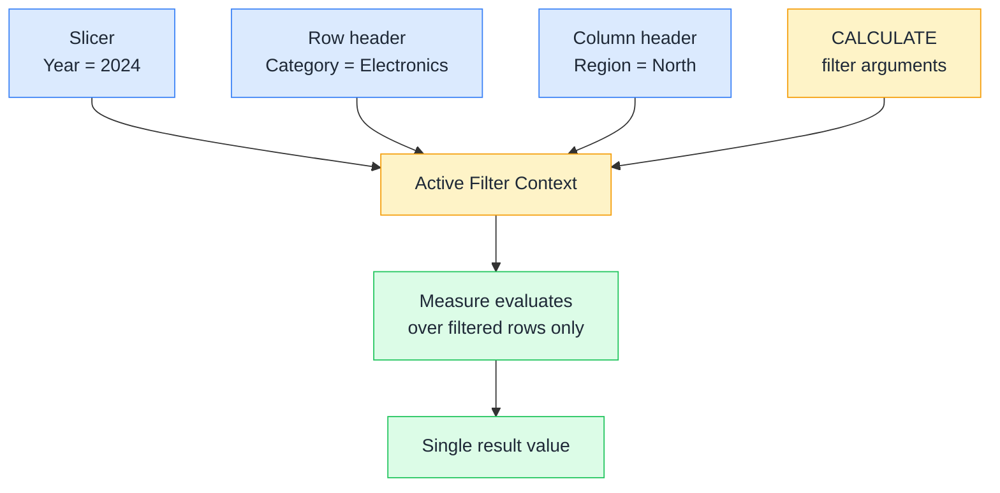

# 🔍 Filter Context

> **🧒 Explain Like I'm 5:** Imagine you're calculating sales, but someone already put on glasses that only let you see rows from 2024 in the North region — that invisible pair of glasses is filter context.

## 🖼️ The Picture

Every cell in a Power BI visual has its own filter context — a table with 3 categories × 4 years = 12 cells = 12 separate measure evaluations.

## 🔧 How it actually works

Filter context is the set of filters that are in effect when a measure starts calculating. It comes from four places: slicers on the report page, row and column headers in a matrix or table visual, page-level and report-level filters in the filter pane, and CALCULATE filter arguments in the measure itself. All of these are AND'd together — each one further narrows the visible rows.

Your measure doesn't choose its filter context. The report hands it one silently, before your first line of DAX ever runs. When you write `Total Sales = SUM(Sales[Amount])`, that single formula returns $120k for Electronics, $85k for Furniture, and $205k for the grand total — all from the same expression, because the filter context changes for each cell.

The only function that can *modify* filter context is CALCULATE. Everything else reads it but cannot change it. This is why CALCULATE is so central to DAX — it's the only door into a different filter context.

## 🌍 Real-world example

A sales manager has a matrix visual with product categories on rows and years on columns. Every cell calls the same `[Total Sales]` measure. The cell at Electronics / 2023 has filter context `{Category = "Electronics", Year = 2023}`. The cell at Furniture / 2024 has `{Category = "Furniture", Year = 2024}`. Power BI evaluates the same formula 12 times, each time with a different filter context automatically applied from the visual structure.

## 🔗 Related

- [🧮 CALCULATE](calculate.md)
- [📏 Row Context](row-context.md)
- [🔄 Context Transition](context-transition.md)
