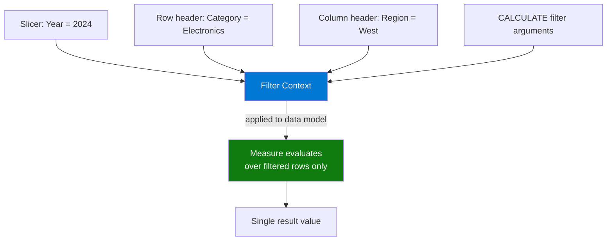

# Filter Context

## ELI5

Think of a coffee shop with a big chalkboard showing total sales. When a customer points to "just espresso drinks" on the menu board, the number on the chalkboard changes to show only espresso sales. The customer's finger is the **filter context** — it silently constrains every number on that board without you having to write different formulas.

Filter context is the set of active filters (from slicers, row/column headers, and CALCULATE) that are in effect when a measure evaluates. Your measure doesn't choose its filter context — the report hands it one.

## Visual — Where filter context comes from



Every cell in a Power BI visual has its own filter context. A table with 3 categories × 4 years = 12 cells = 12 separate measure evaluations, each with a different filter context.

## Pattern

```dax
-- A measure automatically respects filter context — no extra code needed
Total Sales = SUM(Sales[Amount])
-- This single formula returns $120k for Electronics, $85k for Furniture,
-- $205k for the grand total — all from the same DAX

-- CALCULATE lets you override or extend filter context
Electronics Sales = 
CALCULATE(
    SUM(Sales[Amount]),
    Products[Category] = "Electronics"   -- adds/replaces a filter
)

-- ALL() removes filter context for a column — useful for % of total
Sales % of Total = 
DIVIDE(
    SUM(Sales[Amount]),
    CALCULATE(SUM(Sales[Amount]), ALL(Products[Category]))
)

-- ALLSELECTED() respects slicer filters but ignores visual filters
Sales % of Visual Total = 
DIVIDE(
    SUM(Sales[Amount]),
    CALCULATE(SUM(Sales[Amount]), ALLSELECTED(Products[Category]))
)

-- Check what's in filter context programmatically
Current Category = SELECTEDVALUE(Products[Category], "Multiple")
```

## Before / After

| Slicer: Year | Row: Category | `SUM(Sales[Amount])` | `CALCULATE(..., ALL(Products[Category]))` |
|-------------|--------------|---------------------|------------------------------------------|
| 2024 | Electronics | $120,000 | $205,000 |
| 2024 | Furniture | $85,000 | $205,000 |
| 2024 | (All) | $205,000 | $205,000 |
| 2023 | Electronics | $98,000 | $173,000 |

> The Year slicer is still respected by `ALL(Products[Category])` because ALL only removes the Category filter, not the Year filter.

## Key rules

- **Filter context is additive** — each slicer, row, and column header ANDs its filter on top of the others
- **Measures always evaluate inside filter context** — you cannot "turn off" filter context; you can only modify it with CALCULATE
- **Calculated columns have no filter context** — they run during refresh with no active report filters; use row context instead
- **CALCULATE is the only function that can modify filter context** — every other function reads it but cannot change it
- **A blank filter context (grand total row) means all rows are visible** — ALL filters are removed, not that a special "total" filter is applied
