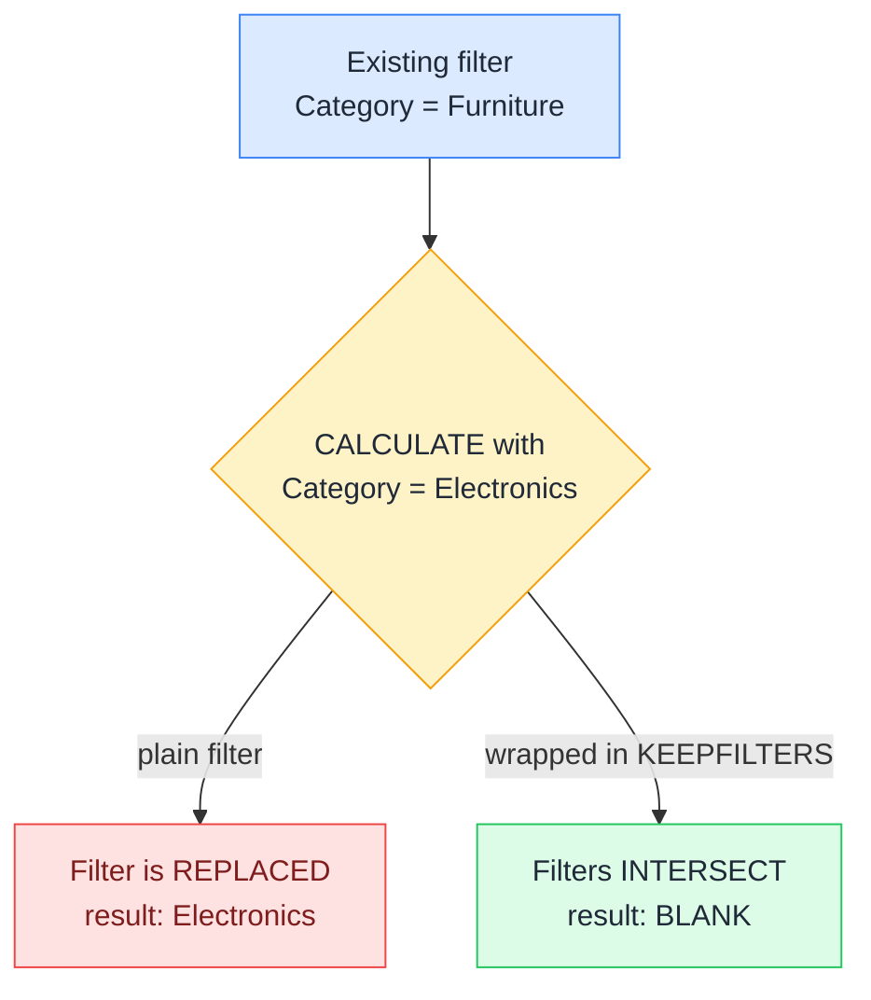

# 🧲 KEEPFILTERS

> **🧒 Explain Like I'm 5:** Normally a new filter shoves the old one out of the way. KEEPFILTERS makes the two share the room, so you only get the rows that satisfy both.

## 🖼️ The Picture



Without KEEPFILTERS your filter overwrites the report's; with it, both must agree.

## 🔧 How it actually works

Every filter argument you pass to CALCULATE quietly does two things: it removes any existing filter on the columns it touches, then applies its own. That override is usually what you want, which is why nobody notices it. It becomes a problem the moment you write a measure that is supposed to narrow the report rather than redirect it.

KEEPFILTERS switches off the removal half. Wrap a filter argument in it and the new filter is intersected with whatever is already in context instead of replacing it. `CALCULATE([Sales], KEEPFILTERS(Products[Category] = "Electronics"))` returns Electronics sales on the Electronics row of a matrix, and BLANK on the Furniture row, because Furniture and Electronics have no overlap. The unwrapped version returns Electronics sales on every row, which looks like a broken measure and is really just the override doing its documented job.

It also applies to table filters: `KEEPFILTERS(TOPN(10, DimProduct, [Total Sales]))` keeps the visual's own product filter alive alongside the top-ten restriction. One thing KEEPFILTERS does not do is fight ALL. If you remove a filter with ALL somewhere in the same CALCULATE, there is nothing left to intersect with, so wrapping something in KEEPFILTERS will not bring the removed filter back.

## 🌍 Real-world example

A retail matrix lists categories down the rows, and the business wants a column showing "sales of high-value orders only", defined as orders over 500. The naive measure `CALCULATE([Total Sales], Sales[Amount] > 500)` is fine here because it touches a column the matrix does not filter. But the sister measure "Electronics share of this row" needs `KEEPFILTERS`: without it, every row of the matrix, Furniture and Clothing included, reports the same Electronics number, and the totals silently stop adding up. With `KEEPFILTERS(Products[Category] = "Electronics")` only the Electronics row returns a value, and the column total matches the row.

```dax
-- Narrows the report instead of overriding it
Electronics Sales (kept) =
CALCULATE(
    SUM(Sales[Amount]),
    KEEPFILTERS(Products[Category] = "Electronics")
)

-- Intersect a virtual table with the visual's own filters
Top 10 Product Sales (kept) =
CALCULATE(
    [Total Sales],
    KEEPFILTERS(TOPN(10, DimProduct, [Total Sales], DESC))
)

-- Keep two conditions honest at the same time
Large Electronics Orders =
CALCULATE(
    SUM(Sales[Amount]),
    KEEPFILTERS(Products[Category] = "Electronics"),
    KEEPFILTERS(Sales[Amount] > 500)
)
```

## 🔗 Related

- [🧮 CALCULATE](calculate.md)
- [🔍 Filter Context](filter-context.md)
- [🔝 TOPN](topn.md)
