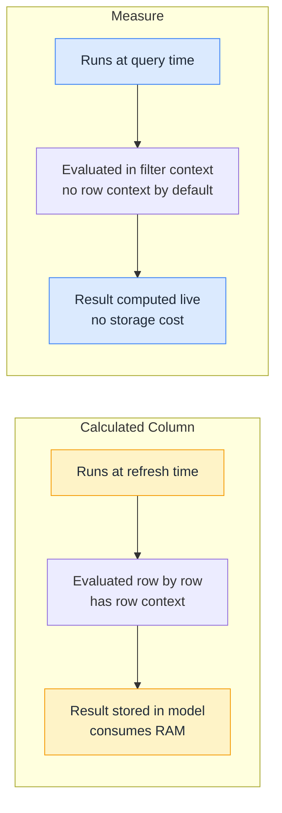

# Measures vs Calculated Columns

## ELI5

A **calculated column** is like filling in a new column on a spreadsheet row by row — it runs once when you save and the result is stored in the table.

A **measure** is like a formula at the bottom of the spreadsheet that recalculates every time you change a filter — it has no fixed answer until there's a context to evaluate in.

Same DAX syntax, completely different behavior.

## Visual



## Pattern

```dax
-- CALCULATED COLUMN: Profit Margin per row (stored in table)
-- Written in the column definition, not a measure
Profit Margin % =
DIVIDE(Sales[Profit], Sales[Revenue])

-- MEASURE: Total Profit Margin (aggregated, context-aware)
Total Profit Margin % =
DIVIDE(SUM(Sales[Profit]), SUM(Sales[Revenue]))
```

## When to use which

| Use case | Column or Measure? | Why |
|----------|--------------------|-----|
| Filter/slice by a computed value | Calculated Column | Slicers need a stored value |
| Show an aggregated number in a visual | Measure | Needs to respond to filters |
| Row-level classification (e.g. "High / Medium / Low") | Calculated Column | Categories stored per row |
| Year-over-year comparison | Measure | Depends on what date is selected |
| Use the result in a relationship | Calculated Column | Relationships need stored keys |
| Ratio or % of total | Measure | Denominator changes with context |

## Before / After

**Wrong approach — calculated column for a ratio:**
```dax
-- This will ALWAYS divide one row's sales by one row's sales = always 100%
Market Share =
DIVIDE(Sales[Amount], SUM(Sales[Amount]))  -- SUM here is in row context, same as Sales[Amount]
```

**Correct approach — measure:**
```dax
Market Share =
DIVIDE(
    SUM(Sales[Amount]),
    CALCULATE(SUM(Sales[Amount]), ALL(Sales))
)
```

## Key rules

1. **Calculated columns consume RAM** — they are materialized and compressed into the model. Use only when you genuinely need a stored value.
2. **Measures cannot be used in slicers or relationships** — if you need to filter by a computed value, it must be a calculated column or a separate table.
3. **SUM() inside a calculated column gives you the column total, not the row value** — this is the single most common mistake when writing column formulas.
4. **Measures are recalculated on every render** — they are fast to write but can be slow if poorly written; optimize with VAR and avoid unnecessary iterators.
5. **Default to measures** — only reach for a calculated column when you have a specific reason (slicing, relationship, row-level label).
