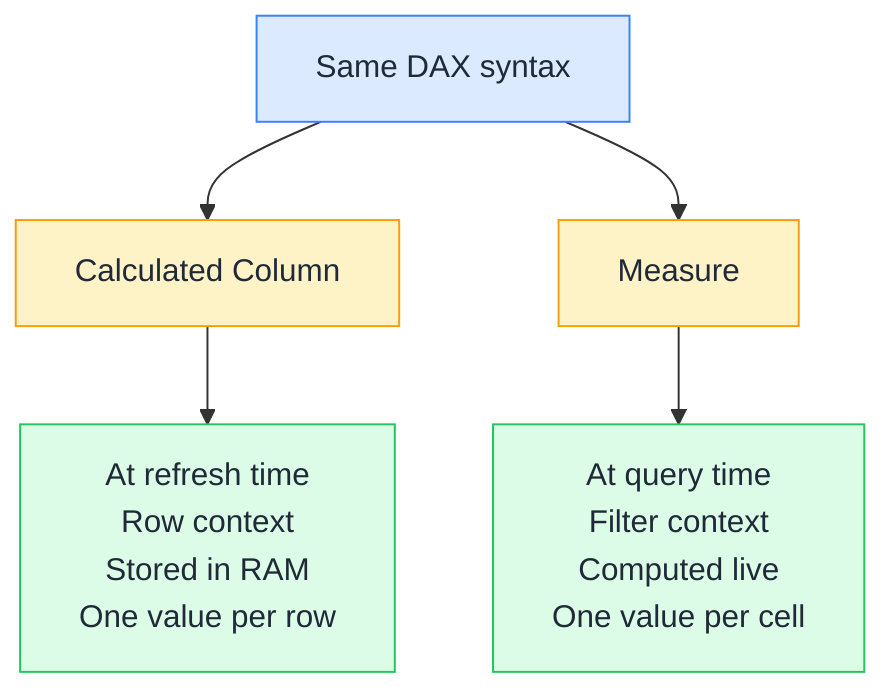

# ⚖️ Measures vs Calculated Columns

> **🧒 Explain Like I'm 5:** A calculated column is filling in a spreadsheet column row by row and saving it forever; a measure is the formula at the bottom that recalculates fresh every time you change a filter.

## 🖼️ The Picture

Same DAX, different execution environment: calculated columns live in the data model, measures live in visuals.

## 🔧 How it actually works

A **calculated column** is evaluated once, at refresh time, for every row in the table. It runs in row context, so it can reference columns from the same row directly. The result is stored in the VertiPaq engine as part of the model, consuming RAM. Because it's stored, a calculated column can be used as a filter or a slicer axis. The downside: it can't respond to user interactions: the value is locked in until the next refresh.

A **measure** is evaluated on demand: every time a visual renders, every time a slicer changes, every time the user interacts with the report. It runs in filter context, which means it automatically responds to slicers, row headers, and CALCULATE arguments. The result is never stored; it's computed fresh each time. This makes measures the right tool for any aggregation or any value that should change based on what the user is looking at.

The most common mistake is putting aggregations in calculated columns. `Revenue = Sales[Quantity] * Sales[UnitPrice]` as a calculated column is fine, that's row-level math. But `Total Revenue = SUM(Sales[Amount])` as a calculated column doesn't make sense: SUM in a column produces the same grand total in every row, wasting RAM and ignoring filter context entirely.

## 🌍 Real-world example

A retail analyst needs two things: the profit margin for each individual product (useful as a filter: "show me only high-margin products"), and the average margin across whatever is currently selected in the report. The per-product margin is a calculated column: it's fixed per row and people want to filter by it. The average margin is a measure: it needs to respond to slicers. Same DAX operators, two completely different homes.

## 🔗 Related

- [📏 Row Context](row-context.md)
- [🔍 Filter Context](filter-context.md)
- [📌 VAR / RETURN](variables.md)
