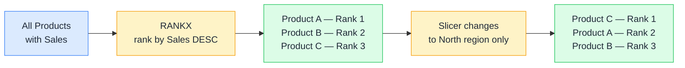

# 🏆 RANKX

> **🧒 Explain Like I'm 5:** RANKX is a live leaderboard that re-sorts itself the moment a new score comes in — or the moment you change a filter.

## 🖼️ The Picture

The rank updates automatically every time the filter context changes — it's not a stored value, it's a live calculation.

## 🔧 How it actually works

RANKX takes a table, an expression, and optional arguments for order, ties, and dense vs. standard ranking. It iterates through the table, evaluates the expression for each row, then determines the rank of the current row's value within that set. The "current row" is determined by the filter context — typically a product or customer in the visual's row axis.

The first argument (the table) is crucial. If you pass `ALL(DimProduct)`, the rank is computed against all products regardless of slicers — giving you a global rank. If you pass `VALUES(DimProduct[Product])`, the rank respects the current filter context — giving you a rank within whatever is currently visible. This difference is almost always the root of RANKX bugs.

Dense ranking (`RANKX(..., , , DENSE)`) means no gaps in the sequence when there are ties — 1, 2, 2, 3. Standard ranking (the default) means ties share the lower rank and the next rank skips — 1, 2, 2, 4. Know which behavior your stakeholders expect before you build.

## 🌍 Real-world example

A sales dashboard shows each store ranked by revenue. The report has a region slicer. The business wants rank 1 to always mean "best in the currently selected region," not "best globally." They write `Store Rank = RANKX(ALL(DimStore), [Total Sales])` initially, but the rank ignores the region slicer. Switching to `RANKX(ALLSELECTED(DimStore), [Total Sales])` makes the rank recalculate within whatever the slicer allows — rank 1 is always the top store in the selected region.

## 🔗 Related

- [🔝 TOPN](topn.md)
- [🎯 ALLSELECTED](allselected.md)
- [🗄️ Virtual Tables](virtual-tables.md)
