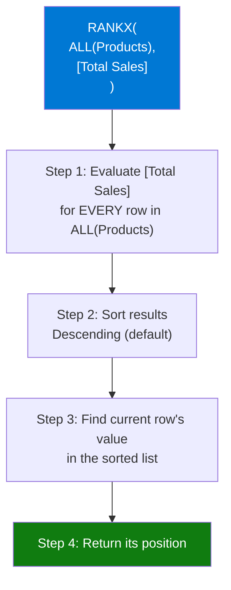

# RANKX

## ELI5

Think of a leaderboard at an arcade. RANKX looks at every player's score (your measure, evaluated across a table), lines them up from highest to lowest, and assigns your current player their position on that board. The ranking recalculates live as filters change — so if you filter to "just this region," the leaderboard resets for that region.

## Visual — How RANKX evaluates



The first argument (the table) defines **who is being ranked**. The second argument (the expression) defines **what they're ranked by**. The current filter context determines **which row you're assigning a rank to**.

## Pattern

```dax
-- Basic rank by total sales, highest = 1
Product Sales Rank = 
RANKX(
    ALL(Products),           -- rank across all products (ignore filter context)
    [Total Sales]            -- expression to rank by (evaluated for each product)
)

-- Rank within current category (respects category filter)
Product Rank in Category = 
RANKX(
    ALLSELECTED(Products[ProductName]),  -- rank within visible products
    [Total Sales]
)

-- Ascending rank (lowest value = 1)
Cost Rank = 
RANKX(
    ALL(Products),
    [Average Unit Cost],
    ,                        -- skip value argument (use expression default)
    ASC                      -- ascending: cheapest = rank 1
)

-- Rank with tie-breaking
Sales Rank Dense = 
RANKX(
    ALL(Products),
    [Total Sales],
    ,
    DESC,
    Dense                    -- Dense: tied items share rank, no gap after tie
)

-- Show only top 5 (blank everything else)
Top 5 Sales Rank = 
VAR Rank = RANKX(ALL(Products), [Total Sales])
RETURN IF(Rank <= 5, Rank, BLANK())
```

## Before / After

| Product | Total Sales | Rank (DESC, Skip) | Rank (DESC, Dense) | Rank (ASC) |
|---------|-------------|-------------------|-------------------|------------|
| Laptop | $120,000 | 1 | 1 | 4 |
| Phone | $95,000 | 2 | 2 | 3 |
| Tablet | $95,000 | 2 | 2 | 3 |
| Keyboard | $45,000 | 4 (gap after tie) | 3 (no gap) | 2 |
| Mouse | $30,000 | 5 | 4 | 1 |

## Key rules

- **The table argument controls who gets ranked** — `ALL(Products)` ranks against all products; `ALLSELECTED(Products)` ranks against only slicer-visible products
- **The expression is evaluated for every row in the table argument, not just the current row** — RANKX iterates the whole table internally
- **Ties use Skip (default) or Dense** — Skip leaves a gap (1,2,2,4); Dense does not (1,2,2,3); choose explicitly to avoid surprises
- **RANKX is slow on large tables** — it evaluates the expression N times for N rows; avoid using it in visuals with thousands of rows
- **The value argument (3rd param) is almost always omitted** — it lets you rank by a different value than the expression; leaving it blank (default) ranks by the expression's result for the current filter context
