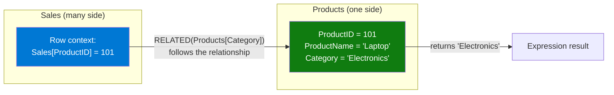

# RELATED

## ELI5

Imagine your Sales spreadsheet has a Product ID column but not the Product Name. The Product Names live in a separate Products table. **RELATED** is the lookup that walks over to the Products table, finds the matching row by ID, and hands you back the Product Name — all while you're sitting on a row in Sales.

RELATED only works when there is a relationship defined between the two tables, and you're asking from the **many side** (Sales) to get something from the **one side** (Products).

## Visual — How RELATED crosses a relationship



The relationship acts as a bridge. RELATED follows the bridge, finds the single matching row on the one-side, and returns the requested column value.

## Pattern

```dax
-- Calculated column: pull category name from Products into Sales
Sales[Category] = RELATED(Products[Category])

-- Calculated column: pull standard cost for margin calculation
Sales[StandardCost] = RELATED(Products[StandardCost])

-- Use RELATED inside SUMX for row-level lookups
Gross Profit = 
SUMX(
    Sales,
    Sales[Revenue] - RELATED(Products[StandardCost])
)

-- RELATED inside FILTER
High Margin Sales = 
CALCULATE(
    SUM(Sales[Revenue]),
    FILTER(
        Sales,
        Sales[Revenue] - RELATED(Products[StandardCost]) > 100
    )
)

-- RELATEDTABLE: the reverse direction (one-to-many)
-- Use from the one-side to get a table of related rows from the many-side
Products[TotalSales] = SUMX(RELATEDTABLE(Sales), Sales[Revenue])
```

## Before / After

| Sales Row | ProductID | Revenue | `RELATED(Products[Category])` | `RELATED(Products[StandardCost])` |
|-----------|-----------|---------|-------------------------------|-----------------------------------|
| 1         | 101       | $1,200  | Electronics                   | $750                              |
| 2         | 205       | $450    | Furniture                     | $200                              |
| 3         | 101       | $800    | Electronics                   | $750                              |

> Without RELATED, you'd have to add the Category column to the Sales table manually — duplicating data and causing sync issues.

## Key rules

- **RELATED requires an active relationship** — if the relationship doesn't exist or is inactive, RELATED returns BLANK; use USERELATIONSHIP inside CALCULATE to activate inactive ones
- **RELATED only travels many-to-one** — from the fact table to a dimension; use RELATEDTABLE for the reverse direction
- **RELATED requires row context** — it only works inside calculated columns or iterator functions (SUMX, FILTER, etc.), not in standalone measures
- **RELATED follows the entire relationship chain** — if Sales → Products → Category is a chain, `RELATED(Category[Name])` works from Sales directly
- **Avoid storing RELATED results as calculated columns when not needed** — using RELATED inside SUMX is more memory-efficient than materializing the column
