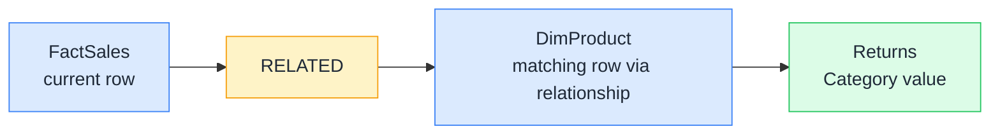

# 🔗 RELATED

> **🧒 Explain Like I'm 5:** You're looking at a sales row and want to know the product's category: RELATED crosses the bridge to the product table and brings back the answer.

## 🖼️ The Picture

RELATED follows the relationship from the many-side table to the one-side table and returns the value from whatever column you ask for.

## 🔧 How it actually works

RELATED only works when you're in a row context, inside a calculated column or an iterator function. It follows an existing relationship from the current table to a related table and returns a single value. Because the relationship is many-to-one (from fact to dimension), there's always exactly one matching row on the other side, so RELATED always returns a scalar.

You can chain RELATED across multiple hops if your model has a chain of relationships: `RELATED(DimSubcategory[CategoryName])` might cross from FactSales → DimProduct → DimSubcategory in one step, as long as all the relationships exist and point in the right direction. Power BI resolves the full path automatically.

RELATED doesn't work from a dimension table looking toward a fact table: that's the "many" side, where there could be multiple matching rows. For that direction, use RELATEDTABLE, which returns all the matching rows as a table rather than a single value.

## 🌍 Real-world example

You want a calculated column on `FactSales` that stores the product category for each sale, so you can slice by category without a relationship. You write `SaleCategory = RELATED(DimProduct[Category])`. As DAX processes each row of `FactSales`, it looks up the `ProductKey` for that row, finds the matching row in `DimProduct`, and returns that product's `Category`. The result is a new column on the fact table that contains the category string for every sale.

## 🔗 Related

- [📏 Row Context](row-context.md)
- [➕ SUM vs SUMX](sum-vs-sumx.md)
- [🔀 USERELATIONSHIP](userelationship.md)
