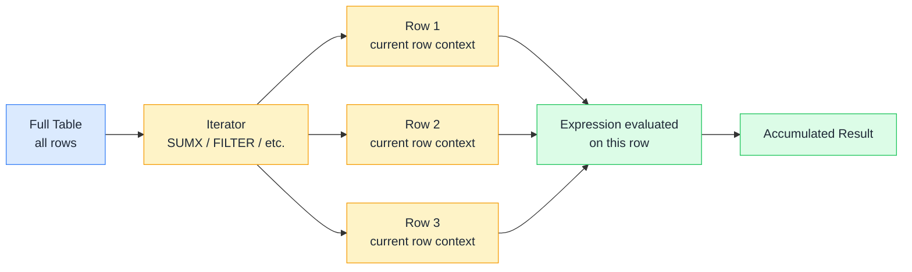

# 📏 Row Context

> **🧒 Explain Like I'm 5:** Picture a conveyor belt moving boxes past you one at a time — row context is whichever box is directly in front of you right now.

## 🖼️ The Picture

Row context moves through the table one row at a time. While it's on a row, any column reference resolves to that row's value.

## 🔧 How it actually works

Row context exists in two places: inside **calculated columns** (where DAX processes each row of the table once at refresh time), and inside **iterator functions** like SUMX, FILTER, ADDCOLUMNS, and MAXX (where DAX loops through each row during query time).

When you're in row context and you reference `Sales[Quantity]`, DAX knows you mean the Quantity value of the current row — not all quantities, not a sum. That's the key difference from filter context: filter context determines which rows are visible, while row context tells you which specific row you're currently on.

Row context does *not* automatically cross relationships. If you're in a calculated column on `FactSales` and want a value from `DimProduct`, you can't just write `DimProduct[Category]` — you need `RELATED(DimProduct[Category])` to follow the relationship. Row context stays on the current table; RELATED is the bridge to related tables.

## 🌍 Real-world example

You add a calculated column to `FactSales` called `Revenue = Sales[Quantity] * Sales[UnitPrice]`. When Power BI processes this at refresh, it creates row context for each row in the table. On row 1, `Sales[Quantity]` resolves to that row's quantity and `Sales[UnitPrice]` resolves to that row's unit price — the multiplication gives you the revenue for that specific sale. The same column formula runs independently for every row, which is exactly what you want.

## 🔗 Related

- [🔍 Filter Context](filter-context.md)
- [➕ SUM vs SUMX](sum-vs-sumx.md)
- [🔄 Context Transition](context-transition.md)
- [🔗 RELATED](related.md)
