# Row Context

## ELI5

Picture a spreadsheet where you're filling in a formula in column C. While you're on row 5, you automatically know what's in columns A and B of **row 5** — that's row context. The formula engine is sitting on a specific row and all column values for that row are visible.

Row context exists during two things: **calculated column formulas** (where you're defining a value for every row) and **iterator functions** like SUMX, FILTER, MAXX — where the engine walks the table one row at a time.

## Visual — Row context vs filter context

```mermaid
flowchart TD
    subgraph "Calculated Column (row context)"
        A["Table: Sales"] --> B["For row 1: Qty=2, Price=$10"]
        B --> C["Profit = Sales[Revenue] - Sales[Cost]"]
        C --> D["Row 1 result: $4"]
        D --> E["Stored in the column for row 1"]
    end

    subgraph "SUMX iterator (row context)"
        F["Sales table"] --> G["Row context moves row by row"]
        G --> H["Expression: Sales[Qty] × Sales[Price]"]
        H --> I["Each row result accumulated"]
        I --> J["Final aggregate returned"]
    end

    style C fill:#0078d4,color:#fff
    style H fill:#107c10,color:#fff
```



Row context gives you access to every column in the **current row** of the table being iterated. It does NOT automatically filter other tables — that's what RELATED and CALCULATE are for.

## Pattern

```dax
-- Calculated column: row context is automatic
-- (This formula goes in the Sales table as a new column)
Profit = Sales[Revenue] - Sales[Cost]

-- Row context in SUMX
Total Margin = 
SUMX(
    Sales,
    Sales[Revenue] - Sales[Cost]   -- row context: each row's Revenue and Cost
)

-- Nested iterators: inner iterator has its own row context
-- (outer row context is shadowed by the inner one for the same table)
Weighted Score = 
SUMX(
    Students,
    SUMX(
        Grades,                            -- inner iterator on Grades table
        Grades[Score] * Grades[Weight]     -- inner row context: current Grades row
    )
)

-- Row context does NOT filter related tables automatically
-- Use RELATED to pull values from the one-side of a relationship
Category Margin = 
SUMX(
    Sales,
    Sales[Revenue] - RELATED(Products[StandardCost])
    --              ^^^^^^^ needed because row context doesn't cross relationships
)

-- CALCULATE inside an iterator converts row context to filter context
Has High Sales = 
SUMX(
    Customers,
    IF(
        CALCULATE(SUM(Sales[Amount])) > 10000,  -- CALCULATE triggers context transition
        1, 0
    )
)
```

## Before / After

| Row | Revenue | Cost | `Profit` calculated column | Contribution to `SUMX` margin |
|-----|---------|------|--------------------------|-------------------------------|
| 1   | $100    | $60  | $40                      | $40                           |
| 2   | $200    | $140 | $60                      | $60                           |
| 3   | $150    | $90  | $60                      | $60                           |
| **Total** | | | (stored per row) | **$160** |

## Key rules

- **Row context exists during calculated columns and iterators** — not in regular measures evaluated by the report
- **Row context does not filter related tables** — use RELATED (many-to-one) or RELATEDTABLE (one-to-many) to cross relationships
- **Nested iterators shadow outer row context** on the same table — the inner loop's row context replaces the outer one for that table
- **CALCULATE inside an iterator converts row context to filter context** — this is called context transition and is often unintentional (see [context-transition.md](context-transition.md))
- **Calculated columns run at refresh time with no active filter context** — they cannot reference slicers or report filters
