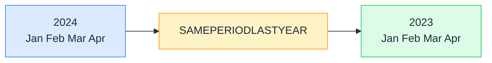

# 📆 SAMEPERIODLASTYEAR

> **🧒 Explain Like I'm 5:** You're looking at this month's numbers, then immediately seeing what those same days looked like exactly one year ago — side by side, no setup required.

## 🖼️ The Picture

The same months, the same days — just shifted back exactly one year. The visual filter tells SAMEPERIODLASTYEAR what period you're looking at; it handles the shift automatically.

## 🔧 How it actually works

SAMEPERIODLASTYEAR is shorthand for `DATEADD('Date'[Date], -1, YEAR)`. It takes a column of dates (always from your date table) and returns a table containing the same dates shifted back one year. When used inside CALCULATE, it replaces the current date filter with last year's equivalent period.

Because it wraps DATEADD, SAMEPERIODLASTYEAR is smart about leap years — shifting February 29, 2024 back one year returns February 28, 2023 (since 2023 has no Feb 29), not an error. The alignment is calendar-based, not day-count-based.

The function requires a continuous date table with no gaps. If your date table skips a day — even one — the YOY comparison can silently return blank for affected periods. This is another reason why a proper, marked date table is non-negotiable for time intelligence.

## 🌍 Real-world example

A retail KPI card shows current month revenue alongside prior year same-month revenue. The two measures are `[Total Sales]` and `Sales SPLY = CALCULATE([Total Sales], SAMEPERIODLASTYEAR('Date'[Date]))`. When the user changes the date slicer from April to July, both cards update simultaneously — the current period moves to July 2024 and the comparison automatically moves to July 2023. No date parameter, no hardcoded year, no measure to update when the year rolls over.

## 🔗 Related

- [⏩ DATEADD](dateadd.md)
- [📅 TOTALYTD](totalytd.md)
- [📌 VAR / RETURN](variables.md)
