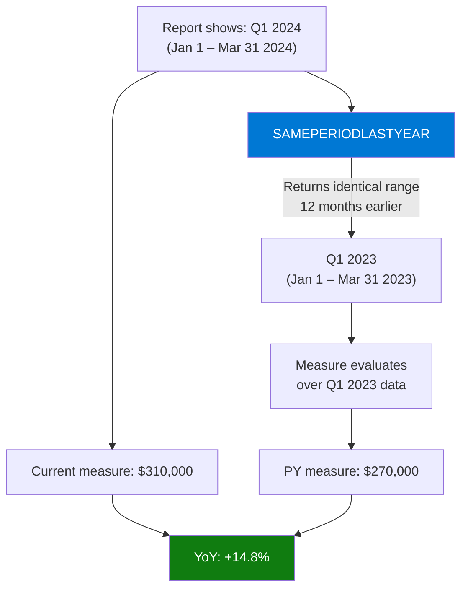

# SAMEPERIODLASTYEAR

## ELI5

It's exactly what it sounds like: whatever time window you're looking at right now (a day, a month, a quarter, a year), give me the same window but exactly one year earlier. If you're looking at Q2 2024, SAMEPERIODLASTYEAR hands you Q2 2023 — same shape, twelve months back.

It is a convenient shorthand for `DATEADD('Date'[Date], -1, YEAR)` — they produce identical results.

## Visual — SAMEPERIODLASTYEAR mirrors the date range



## Pattern

```dax
-- Prior year sales
Sales PY = 
CALCULATE(
    SUM(Sales[Amount]),
    SAMEPERIODLASTYEAR('Date'[Date])
)

-- Year-over-year absolute change
Sales YoY Change = 
SUM(Sales[Amount]) - [Sales PY]

-- Year-over-year percentage change
Sales YoY % = 
DIVIDE(
    SUM(Sales[Amount]) - [Sales PY],
    [Sales PY]
)

-- Combine with TOTALYTD for YTD vs prior-year YTD
Sales YTD = TOTALYTD(SUM(Sales[Amount]), 'Date'[Date])

Sales YTD PY = 
CALCULATE(
    [Sales YTD],
    SAMEPERIODLASTYEAR('Date'[Date])
)

-- Conditional formatting helper: growth direction
YoY Direction = 
IF([Sales YoY %] > 0, "▲", IF([Sales YoY %] < 0, "▼", "—"))
```

## Before / After

| Period | Current Sales | Sales PY | YoY Change | YoY % |
|--------|--------------|----------|------------|-------|
| Jan 2024 | $100,000 | $88,000 | +$12,000 | +13.6% |
| Feb 2024 | $105,000 | $91,000 | +$14,000 | +15.4% |
| Mar 2024 | $105,000 | $92,000 | +$13,000 | +14.1% |
| Q1 2024 | $310,000 | $271,000 | +$39,000 | +14.4% |

> The measure works correctly at any grain — daily, monthly, quarterly, or yearly — without any modification.

## Key rules

- **Identical to `DATEADD('Date'[Date], -1, YEAR)`** — use whichever is more readable; SAMEPERIODLASTYEAR is preferred for clarity
- **Requires a marked Date table** — the Date table must be continuous and marked as a Date Table in the model
- **Works correctly at any date grain** — whether the current context is a single day, a month, or a full year, SAMEPERIODLASTYEAR shifts the entire range back 12 months
- **Returns BLANK for dates where prior year data doesn't exist** — if your data starts January 2023, SAMEPERIODLASTYEAR for January 2023 returns BLANK (no 2022 rows); protect your YoY% with DIVIDE to avoid division-by-zero errors
- **Fiscal years: use DATEADD with caution** — SAMEPERIODLASTYEAR always shifts by exactly 365/366 days, which may not align with custom fiscal year boundaries; test with fiscal calendar data
