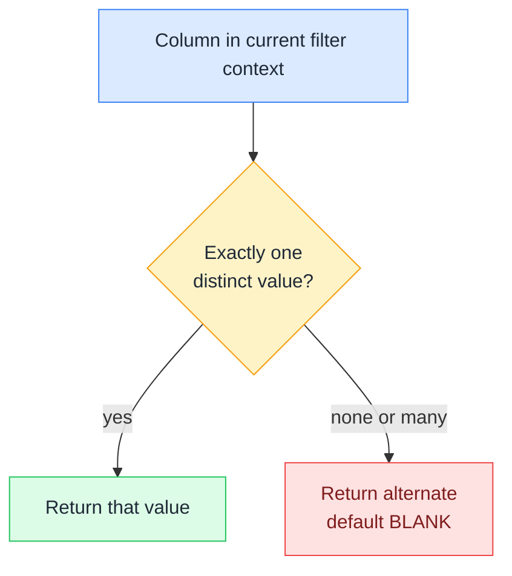

# 🎛️ SELECTEDVALUE

> **🧒 Explain Like I'm 5:** It asks one question: "has the user picked exactly one thing?" If yes, you get that thing. If they picked none or picked five, you get the backup answer you chose in advance.

## 🖼️ The Picture



One value in context gives you the value; zero or many gives you the fallback, never an error.

## 🔧 How it actually works

SELECTEDVALUE takes a column and an optional alternate result. It looks at the filter context, and if exactly one distinct value of that column survives, it returns it. Otherwise it returns the alternate result, or BLANK if you did not supply one. It is exactly equivalent to `IF(HASONEVALUE(Column), VALUES(Column), alternate)`, just written in one line instead of three.

The reason it exists is that DAX cannot silently turn a many-row table into a single value. Writing `VALUES(Products[Category])` where a scalar is expected works only while exactly one category is in context, and throws an error the moment the user clears the slicer or the measure lands on a total row. SELECTEDVALUE is the safe version: the multi-value case is handled by design instead of by crash.

Remember that "selected" means "present in the filter context", not "clicked by a human". A row header in a matrix, a cross-filter from another visual, and a CALCULATE filter all count. This is what makes SELECTEDVALUE work naturally in a matrix: on each category row a single value is in context, and on the grand total row it correctly falls back to your default.

## 🌍 Real-world example

A report has a disconnected table `'Currency Picker'` with the values USD, EUR, and GBP, shown as a slicer. The measure `Converted Sales` needs to know which one is active. With `VAR Cur = SELECTEDVALUE('Currency Picker'[Code], "USD")` the measure reads the picker, defaults to USD when the user has cleared the slicer or selected all three, and never errors. The same trick drives dynamic titles: `Title = "Sales for " & SELECTEDVALUE(Products[Category], "All Categories")` shows "Sales for Electronics" with one category selected and "Sales for All Categories" otherwise.

```dax
-- Read a disconnected picker with a safe default
Selected Currency =
SELECTEDVALUE('Currency Picker'[Code], "USD")

-- Dynamic visual title that degrades gracefully
Category Title =
"Sales for " & SELECTEDVALUE(Products[Category], "All Categories")

-- What it replaces: the long form
Selected Currency Long =
IF(
    HASONEVALUE('Currency Picker'[Code]),
    VALUES('Currency Picker'[Code]),
    "USD"
)
```

## 🔗 Related

- [🔍 Filter Context](filter-context.md)
- [🚦 SWITCH](switch.md)
- [0️⃣ Blank vs Zero](blank-vs-zero.md)
