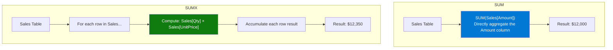

# SUM vs SUMX

## ELI5

Imagine you have a receipt from a grocery store. **SUM** is like adding up the "Total" column that's already printed on the receipt. **SUMX** is like going row by row, calculating a custom price for each item (say, applying a special discount), and *then* adding those results up.

SUM aggregates a column that already exists. SUMX iterates every row, computes something, and then aggregates those computed values.

## Visual — How SUM and SUMX differ in execution



SUM reads one column. SUMX walks the table row by row and evaluates any expression — it has **row context** during each iteration.

## Pattern

```dax
-- SUM: aggregate a pre-existing column
Total Sales = SUM(Sales[Amount])

-- SUMX: compute per-row then aggregate
-- Use when the value you want doesn't exist as a stored column
Revenue = 
SUMX(
    Sales,                            -- table to iterate
    Sales[Quantity] * Sales[UnitPrice] -- expression evaluated on each row
)

-- SUMX with a related table lookup
Revenue with Discount = 
SUMX(
    Sales,
    Sales[Quantity] * RELATED(Products[ListPrice]) * (1 - Sales[DiscountPct])
)

-- SUMX over a virtual table (advanced)
Top Customer Revenue = 
SUMX(
    TOPN(10, Customers, [Total Sales], DESC),
    [Total Sales]
)
```

## Before / After

| Qty | Unit Price | Stored Amount | SUM(Amount) | SUMX(Qty × Price) |
|-----|-----------|--------------|-------------|-------------------|
| 2   | $10       | $20          | —           | $20               |
| 5   | $8        | $30 (stale)  | —           | $40               |
| 1   | $15       | $15          | —           | $15               |
| **Total** | | | **$65 (stale)** | **$75 (accurate)** |

> Note: when the stored Amount column hasn't been refreshed after a price change, SUM gives a wrong answer. SUMX always recomputes.

## Key rules

- **Use SUM when the column already contains the final value** — it is faster and simpler
- **Use SUMX when the value requires row-level computation** — multiplication, conditional logic, or lookups via RELATED
- **SUMX establishes row context** — inside the expression argument you can reference any column of the iterated table directly
- **SUMX over large tables is slower** — avoid iterating millions of rows when a calculated column + SUM would serve the same purpose
- **Never use SUM inside SUMX's expression** — SUM ignores row context; use the column reference directly (e.g., `Sales[Amount]`, not `SUM(Sales[Amount])`)
