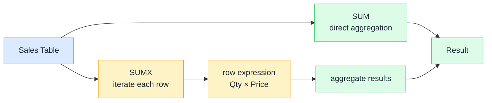

# ➕ SUM vs SUMX

> **🧒 Explain Like I'm 5:** SUM adds up the "Total" column already printed on a receipt; SUMX goes item by item, works out a custom price for each one, and then adds those up.

## 🖼️ The Picture

SUM takes a single stored column and adds it up in one pass. SUMX walks every row, evaluates an expression, and accumulates the results.

## 🔧 How it actually works

SUM is the simpler of the two: it reaches into a column, adds every value together, and hands back a number. There's no looping, no per-row logic. If the answer you want already lives in a column, SUM is the right tool.

SUMX is an *iterator*. It takes a table and an expression. For each row in the table it evaluates the expression in that row's context, stores the result, then moves to the next row. When it's done looping it adds all the stored results together. That per-row context is called **row context**, and it's what makes SUMX so flexible: you can multiply columns, call RELATED, apply conditionals, anything.

The practical rule: if the column already exists, use SUM. If you need to compute something row by row before summing, use SUMX. Using SUMX where SUM would do is not wrong, just slower: SUMX has iteration overhead.

## 🌍 Real-world example

Your `FactSales` table has `Quantity` and `UnitPrice` columns but no pre-computed `Revenue` column. You can't SUM revenue because it doesn't exist as a stored value. Instead you write `Revenue = SUMX(FactSales, FactSales[Quantity] * FactSales[UnitPrice])`. DAX loops through every sales row, multiplies quantity by unit price on that row, and accumulates the total. If prices later change in the product table, a `SUMX` with `RELATED(DimProduct[ListPrice])` will always pick up the current price, no stale stored column.

## 🔗 Related

- [📏 Row Context](row-context.md)
- [🔗 RELATED](related.md)
- [⚖️ Measures vs Calculated Columns](measures-vs-calculated-columns.md)
