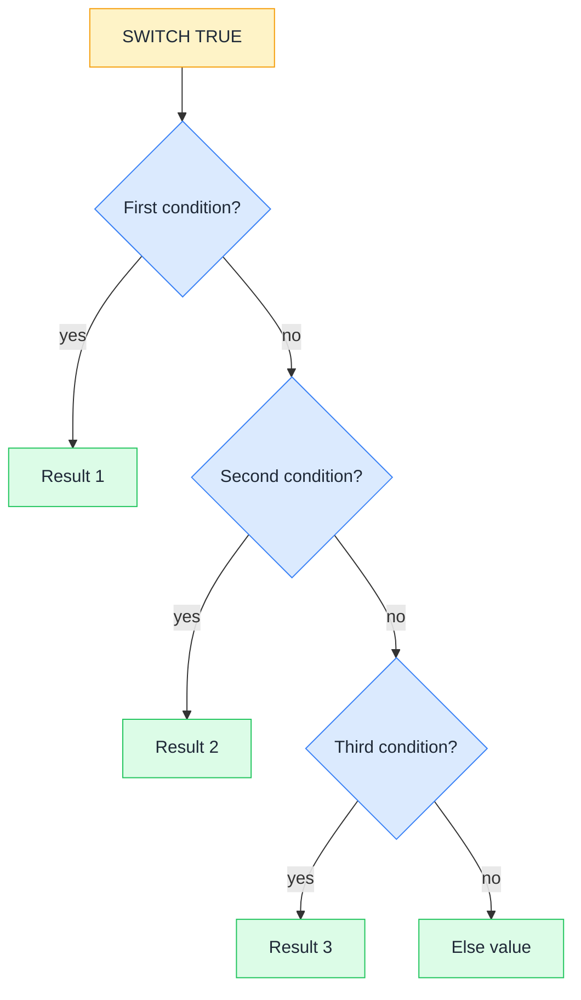

# 🚦 SWITCH

> **🧒 Explain Like I'm 5:** Instead of asking a long chain of "is it this? no, is it that? no, is it the other?" questions, SWITCH lets you write the whole list of answers once, in a way you can still read six months later.

## 🖼️ The Picture



SWITCH evaluates conditions top to bottom and stops at the first match, so order is part of the logic.

## 🔧 How it actually works

SWITCH has two modes. The plain mode compares one expression against a list of values: `SWITCH(Products[Size], "S", "Small", "M", "Medium", "L", "Large", "Unknown")`. The arguments come in pairs (value, result), and the final lone argument is the fallback when nothing matched. This mode is exact-match only: no ranges, no greater-than.

The mode you will actually use most is `SWITCH(TRUE(), ...)`. Because the first argument is literally the value TRUE, every pair becomes "is this condition true? then return this". That turns SWITCH into a flat, readable replacement for nested IF statements, and it supports any condition you can write: ranges, comparisons against measures, combinations with AND and OR.

Two things to keep in mind. First, evaluation stops at the first true condition, so your conditions must be ordered from most specific to most general. If you put `[Total Sales] > 0` before `[Total Sales] > 1000000`, nothing will ever reach the second branch. Second, every branch should return the same data type. Mixing text and numbers across branches makes the column type ambiguous and can break visuals that expect a number.

## 🌍 Real-world example

A sales dashboard needs a "Deal Size" bucket for every order: Enterprise above 100,000, Mid-Market from 25,000 to 100,000, SMB from 1,000 to 25,000, and Micro below that. A nested IF version is four levels deep and nearly unreadable in a formula bar. With SWITCH it reads like the business rule itself, top to bottom, and a new bucket is one extra line rather than a re-nested expression.

```dax
-- SWITCH(TRUE()) as a readable IF chain
Deal Size =
SWITCH(
    TRUE(),
    Sales[Amount] > 100000, "Enterprise",
    Sales[Amount] > 25000,  "Mid-Market",
    Sales[Amount] > 1000,   "SMB",
    "Micro"
)

-- Plain mode: exact match against a single column
Size Label =
SWITCH(
    Products[Size],
    "S", "Small",
    "M", "Medium",
    "L", "Large",
    "Unknown"
)

-- A measure selector driven by a disconnected slicer table
Selected KPI =
SWITCH(
    SELECTEDVALUE('KPI Picker'[KPI], "Sales"),
    "Sales",  [Total Sales],
    "Margin", [Total Margin],
    "Units",  [Total Units],
    BLANK()
)
```

## 🔗 Related

- [📌 VAR / RETURN](variables.md)
- [🎛️ SELECTEDVALUE](selectedvalue.md)
- [0️⃣ Blank vs Zero](blank-vs-zero.md)
