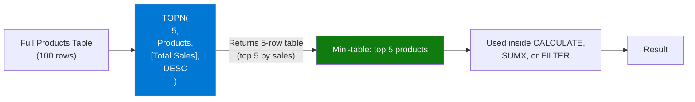

# TOPN

## ELI5

TOPN is like telling a waiter: "Bring me the 5 best-selling dishes on the menu." It hands you back a mini-table containing only those rows — you then do whatever you want with that smaller table (sum it, iterate it, filter further). It doesn't return a single number; it returns a **table** of the top N rows.

## Visual — TOPN as a table filter



TOPN is almost always used as a table argument inside another function — CALCULATE, SUMX, or CONCATENATEX.

## Pattern

```dax
-- Total sales of the top 5 products
Top 5 Products Sales = 
CALCULATE(
    SUM(Sales[Amount]),
    TOPN(5, Products, [Total Sales], DESC)
    -- TOPN returns a 5-row Products table; CALCULATE uses it as a filter
)

-- Iterate the top N rows with SUMX
Top 3 Revenue Weighted = 
SUMX(
    TOPN(3, Products, [Total Sales], DESC),
    [Total Sales] * Products[Margin %]
)

-- Concatenate names of top 5 products
Top 5 Product Names = 
CONCATENATEX(
    TOPN(5, Products, [Total Sales], DESC),
    Products[ProductName],
    ", ",
    [Total Sales], DESC
)

-- Dynamic N from a parameter table
Top N Sales = 
CALCULATE(
    SUM(Sales[Amount]),
    TOPN(
        SELECTEDVALUE(TopN_Param[N], 10),  -- default 10 if no selection
        Products,
        [Total Sales],
        DESC
    )
)

-- Bottom N (worst performers)
Bottom 5 Sales = 
CALCULATE(
    SUM(Sales[Amount]),
    TOPN(5, Products, [Total Sales], ASC)  -- ASC = smallest first
)
```

## Before / After

| Scenario | Without TOPN (all products) | TOPN(3, ..., DESC) | TOPN(3, ..., ASC) |
|----------|-----------------------------|--------------------|-------------------|
| Total Sales | $450,000 | $285,000 (top 3) | $42,000 (bottom 3) |
| Products included | All 20 | Laptop, Phone, Tablet | Mouse, Cable, Adapter |

> TOPN ranking is evaluated within the current filter context — slicers still apply unless you wrap the table argument in ALL().

## Key rules

- **TOPN returns a table, not a scalar** — you must wrap it in an aggregating context (CALCULATE, SUMX, etc.); you cannot display it directly as a measure
- **Ties in the ranking value can cause TOPN to return more than N rows** — if 3 products are tied for position 5 and you asked for TOPN(5), you may get 7 rows
- **TOPN respects the current filter context of its table argument** — use `TOPN(5, ALL(Products), ...)` to rank across all products regardless of slicers
- **Sort direction defaults to DESC if omitted** — explicitly specify ASC or DESC to make intent clear
- **Use with CALCULATETABLE for a reusable virtual table** — `VAR TopProducts = TOPN(5, Products, [Total Sales])` captures the table for multiple uses in a single measure
