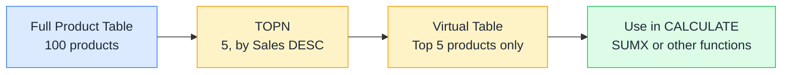

# 🔝 TOPN

> **🧒 Explain Like I'm 5:** TOPN cuts the list: you say "show me only the five best-selling products" and it hands you exactly that, as a table you can use in further calculations.

## 🖼️ The Picture

TOPN returns a virtual table, not a number. You use that table as an argument to CALCULATE, SUMX, or any other function that accepts a table.

## 🔧 How it actually works

TOPN takes four arguments: the number of rows to return, the table to rank, the expression to rank by, and the order direction (DESC for top, ASC for bottom). It returns a table containing the N rows with the highest (or lowest) values of the expression. Ties at the boundary are handled by returning all tied rows, so TOPN(5, ...) might return 6 rows if two products are tied for 5th place.

Because TOPN returns a table, you typically use it in one of two ways: as the table argument to SUMX (to sum a measure over only the top N items), or wrapped in CALCULATE as a filter (to make a measure evaluate only over those items). The second pattern is especially powerful: `CALCULATE([Total Sales], TOPN(5, DimProduct, [Total Sales]))` returns the combined revenue of the top 5 products, respecting whatever other filters are active.

TOPN is dynamic: it recalculates with every filter context change. The "top 5 products" in January might be different from the "top 5 products" in Q3. This is usually what you want, but occasionally causes confusion when stakeholders expect a fixed list.

## 🌍 Real-world example

An executive dashboard shows a KPI for "revenue from top 10 customers." The business defines this as the top 10 customers by total revenue within the selected period, not a fixed static list. The measure `Top 10 Customer Revenue = CALCULATE([Total Sales], TOPN(10, DimCustomer, [Total Sales], DESC))` recalculates automatically when the date slicer changes. In Q1, the top 10 might include Customer A. In Q4, Customer B might displace them. The measure handles it without any maintenance.

## 🔗 Related

- [🏆 RANKX](rankx.md)
- [🗄️ Virtual Tables](virtual-tables.md)
- [🎯 ALLSELECTED](allselected.md)
