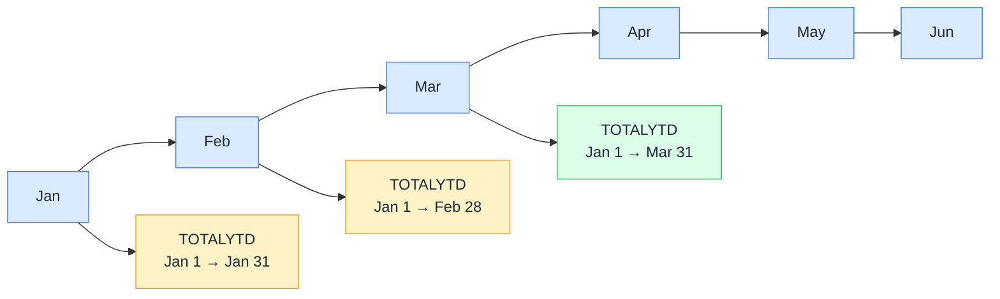

# 📅 TOTALYTD

> **🧒 Explain Like I'm 5:** Think of a savings account balance that resets to zero on January 1st and just keeps adding up all year — that's what TOTALYTD does to your sales.

## 🖼️ The Picture

Each month, TOTALYTD expands its date window back to January 1st. The window grows with every passing month; it never shrinks until the year rolls over.

## 🔧 How it actually works

TOTALYTD is a shortcut for `CALCULATE([measure], DATESYTD('Date'[Date]))`. Under the hood, DATESYTD generates a table of every date from January 1st of the current year up to the last date in the current filter context. TOTALYTD then feeds that date table as a filter to CALCULATE, which replaces the existing date filter with the expanded YTD range.

The third argument to TOTALYTD is an optional fiscal year-end date string — `"6/30"` for a June fiscal year-end, for example. When you provide it, TOTALYTD resets its window at the start of your fiscal year instead of January 1st. This is one of the few time intelligence functions with built-in fiscal year support.

TOTALYTD requires a proper date table marked as a date table in your model. Without it, the date arithmetic that generates the rolling window won't work. The date table must also be continuous — no gaps — for the result to be accurate.

## 🌍 Real-world example

A retail chain publishes monthly reports showing both monthly revenue and year-to-date revenue side by side. The monthly revenue is `[Total Sales]` — straightforward. The YTD column uses `Sales YTD = TOTALYTD([Total Sales], 'Date'[Date])`. In January it shows January's total. In March it shows January + February + March. In December it shows the full year. No CALCULATE, no DATEADD, no date table slicing by hand — one function handles all of it.

## 🔗 Related

- [⏩ DATEADD](dateadd.md)
- [📆 SAMEPERIODLASTYEAR](sameperiodlastyear.md)
- [🗓️ DATESBETWEEN](datesbetween.md)
