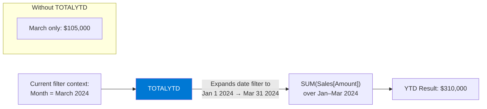

# TOTALYTD

## ELI5

Think of a odometer on a car — it doesn't reset every time you stop; it keeps accumulating from January 1st. **TOTALYTD** is your DAX odometer: it gives you the running total of a measure from the first day of the year up to whatever date is currently in context.

Every time the date moves forward, TOTALYTD automatically expands the date window back to January 1st and re-aggregates.

## Visual — How TOTALYTD expands the date range



TOTALYTD replaces the date filter in context with a range from the start of the fiscal/calendar year to the last date in context.

## Pattern

```dax
-- Basic: calendar year (resets Jan 1)
Sales YTD = 
TOTALYTD(
    SUM(Sales[Amount]),
    'Date'[Date]
)

-- Fiscal year ending June 30 (year resets July 1)
Sales YTD Fiscal = 
TOTALYTD(
    SUM(Sales[Amount]),
    'Date'[Date],
    "06-30"            -- year-end date in MM-DD format
)

-- Equivalent long form using CALCULATE + DATESYTD
Sales YTD Manual = 
CALCULATE(
    SUM(Sales[Amount]),
    DATESYTD('Date'[Date])
)

-- Fiscal year long form
Sales YTD Fiscal Manual = 
CALCULATE(
    SUM(Sales[Amount]),
    DATESYTD('Date'[Date], "06-30")
)

-- YTD vs prior year YTD comparison
Sales YTD PY = 
CALCULATE(
    [Sales YTD],
    DATEADD('Date'[Date], -1, YEAR)
)
```

## Before / After

| Month | Monthly Sales | Sales YTD | Sales YTD (Prior Year) |
|-------|--------------|-----------|------------------------|
| Jan 2024 | $100,000 | $100,000 | $88,000 |
| Feb 2024 | $105,000 | $205,000 | $179,000 |
| Mar 2024 | $105,000 | $310,000 | $270,000 |
| Apr 2024 | $98,000 | $408,000 | $355,000 |

> YTD always grows monotonically within a year. If it dips, your Date table likely has gaps.

## Key rules

- **Requires a marked Date table** — the Date column must be part of a table marked as a Date Table in Power BI, or the function will error
- **The Date table must be contiguous (no gaps)** — missing dates cause TOTALYTD to under-count
- **The year-end date parameter is the *last* day of your fiscal year**, not the first day of the new year — e.g., June fiscal year end = `"06-30"`, not `"07-01"`
- **TOTALYTD is syntactic sugar for CALCULATE + DATESYTD** — if you need more control (e.g., custom filters), use the long form
- **Avoid using TOTALYTD in row-level security contexts** — the date expansion can leak data across security boundaries; test explicitly
