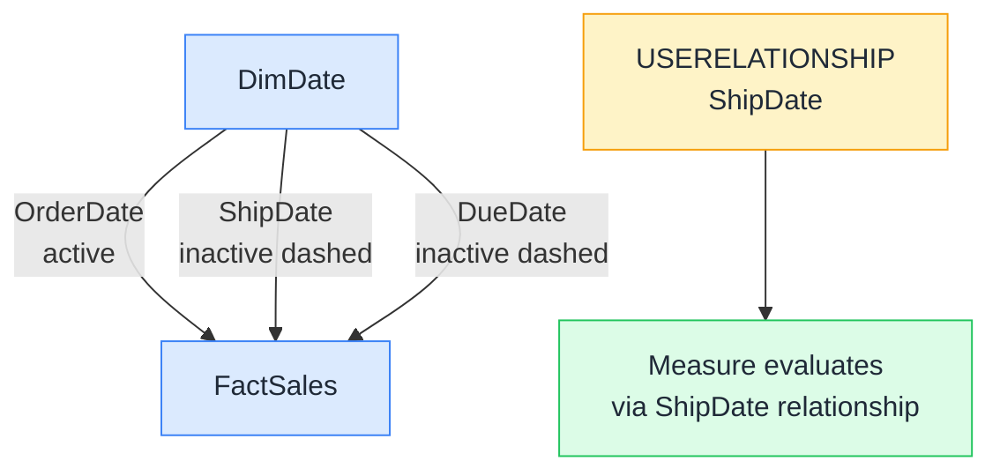

# 🔀 USERELATIONSHIP

> **🧒 Explain Like I'm 5:** You have three doors (relationships) between two tables, but only one can be open at a time. USERELATIONSHIP lets you open a different door just for the duration of one calculation.

## 🖼️ The Picture

The active OrderDate relationship is the default for every other measure. USERELATIONSHIP temporarily swaps it to ShipDate for just this one measure, and switches back automatically when the measure finishes.

## 🔧 How it actually works

A Power BI model can have multiple relationships between the same two tables, but only one can be active at a time. Active means "used automatically when filters flow between the tables." Inactive relationships exist in the model but are ignored unless you explicitly activate them with USERELATIONSHIP.

USERELATIONSHIP must appear inside a CALCULATE call: it's a modifier that changes how CALCULATE routes filters. You pass the two columns that define the relationship you want to activate (in the same format as the relationship itself: `USERELATIONSHIP(FactSales[ShipDate], 'Date'[Date])`). For the duration of that CALCULATE, filters on the date table flow through the ShipDate column instead of OrderDate. When CALCULATE finishes, the default relationship resumes.

The most common use case is role-playing dimensions: one date table with multiple relationships to the same fact table (OrderDate, ShipDate, DueDate). Each role gets its own measure using USERELATIONSHIP to route through the correct column.

## 🌍 Real-world example

A logistics team needs two measures on the same report: "Revenue by Order Date" (the default, uses the active relationship automatically) and "Revenue by Ship Date" (uses USERELATIONSHIP). They write `Sales by Ship Date = CALCULATE([Total Sales], USERELATIONSHIP(FactSales[ShipDateKey], 'Date'[DateKey]))`. Both measures use the same DimDate slicer. When the user selects March, "Revenue by Order Date" shows orders placed in March, while "Revenue by Ship Date" shows orders that shipped in March, regardless of when they were placed.

## 🔗 Related

- [🔗 RELATED](related.md)
- [🧮 CALCULATE](calculate.md)
- [🗄️ Virtual Tables](virtual-tables.md)
