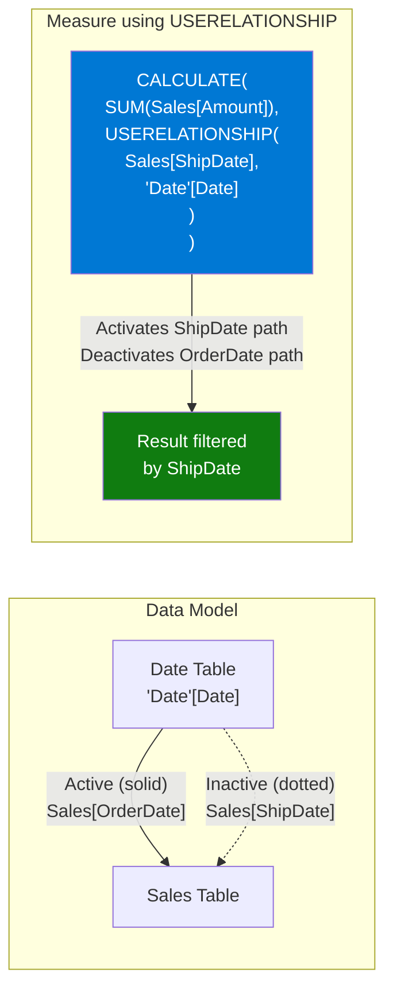

# USERELATIONSHIP

## ELI5

In Power BI you can have more than one relationship between two tables, but only one can be "on" at a time — the others are inactive (shown as dotted lines in the model view). USERELATIONSHIP is a light switch: inside a specific CALCULATE, it flips on an inactive relationship while temporarily turning off the active one.

The classic example is a Date table connected to a Sales table via both OrderDate and ShipDate — one is active, one is dormant. USERELATIONSHIP lets you measure sales by ShipDate without duplicating your Date table.

## Visual — Switching between active and inactive relationships



## Pattern

```dax
-- Sales measured by ShipDate instead of OrderDate
Sales by Ship Date = 
CALCULATE(
    SUM(Sales[Amount]),
    USERELATIONSHIP(Sales[ShipDate], 'Date'[Date])
)

-- Sales measured by DueDate
Sales by Due Date = 
CALCULATE(
    SUM(Sales[Amount]),
    USERELATIONSHIP(Sales[DueDate], 'Date'[Date])
)

-- USERELATIONSHIP combined with other filters
Shipped Electronics 2024 = 
CALCULATE(
    SUM(Sales[Amount]),
    USERELATIONSHIP(Sales[ShipDate], 'Date'[Date]),
    Products[Category] = "Electronics",
    'Date'[Year] = 2024
)

-- Role-playing dimension: two Date tables (alternative approach)
-- Some models use separate "Order Date" and "Ship Date" dimension tables
-- to avoid needing USERELATIONSHIP entirely
```

## Before / After

| Month (Date slicer) | Sales (by OrderDate, default) | Sales by ShipDate (`USERELATIONSHIP`) |
|--------------------|-------------------------------|---------------------------------------|
| Jan 2024 | $100,000 | $87,000 |
| Feb 2024 | $105,000 | $112,000 |
| Mar 2024 | $105,000 | $108,000 |

> The difference occurs because orders placed in March may ship in April, and orders shipped in February were placed in January.

## Key rules

- **USERELATIONSHIP only works inside CALCULATE** — it is a modifier function; calling it outside CALCULATE does nothing
- **The relationship must already exist in the model (even if inactive)** — you cannot create a relationship on the fly with USERELATIONSHIP
- **The active relationship on the same column pair is automatically deactivated** — you don't need to explicitly turn off the active one; DAX handles it
- **Both columns in the USERELATIONSHIP call must be the join keys** — pass the exact columns used in the relationship definition, not any other columns
- **Consider role-playing dimension tables as an alternative** — creating separate dimension tables (OrderDate dim, ShipDate dim) avoids USERELATIONSHIP entirely and often performs better in large models
