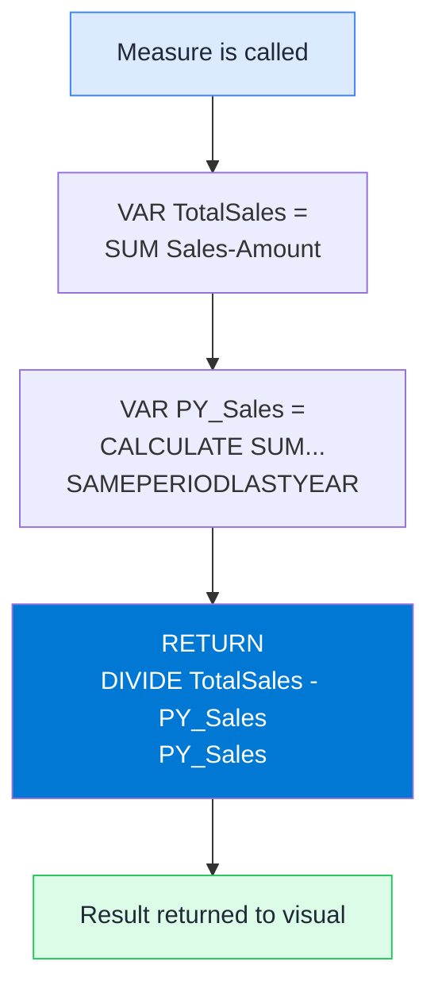

# VAR / RETURN (Variables)

## ELI5

Imagine you're doing a tax return and you need to calculate your gross income four times in different formulas. Instead of recalculating it each time, you write it on a sticky note at the top and just reference the note each time.

VAR is that sticky note. You calculate something once, give it a name, and reuse it. DAX only evaluates it once — so it's faster, shorter, and far easier to debug.

## Visual



## Pattern

```dax
-- Without VAR — hard to read, evaluates SUM twice
YoY % Change =
DIVIDE(
    SUM(Sales[Amount]) - CALCULATE(SUM(Sales[Amount]), SAMEPERIODLASTYEAR('Date'[Date])),
    CALCULATE(SUM(Sales[Amount]), SAMEPERIODLASTYEAR('Date'[Date]))
)

-- With VAR — evaluated once, readable, debuggable
YoY % Change =
VAR CurrentSales = SUM(Sales[Amount])
VAR PriorYearSales =
    CALCULATE(
        SUM(Sales[Amount]),
        SAMEPERIODLASTYEAR('Date'[Date])
    )
RETURN
    DIVIDE(CurrentSales - PriorYearSales, PriorYearSales)
```

## Debugging with VAR

```dax
-- Replace RETURN value with any VAR to inspect intermediate results
YoY % Change =
VAR CurrentSales = SUM(Sales[Amount])
VAR PriorYearSales =
    CALCULATE(SUM(Sales[Amount]), SAMEPERIODLASTYEAR('Date'[Date]))
VAR Difference = CurrentSales - PriorYearSales
RETURN
    PriorYearSales  -- swap this to any VAR to see its value in the visual
```

## Key rules

1. **VARs are evaluated in the filter context at the point of definition** — not at the RETURN line. If you define a VAR outside of CALCULATE, it does not inherit filters added later.
2. **VARs cannot reference each other out of order** — a VAR can reference an earlier VAR but not a later one.
3. **VARs are not re-evaluated on each row** — they evaluate once, which makes them faster than repeating an expression inside an iterator.
4. **RETURN must be the last line** — everything after VAR declarations and before RETURN is a variable definition, not an expression.
5. **Always use VAR for expressions used more than once** — double evaluation is wasted compute and invites bugs if you edit one copy but forget the other.
