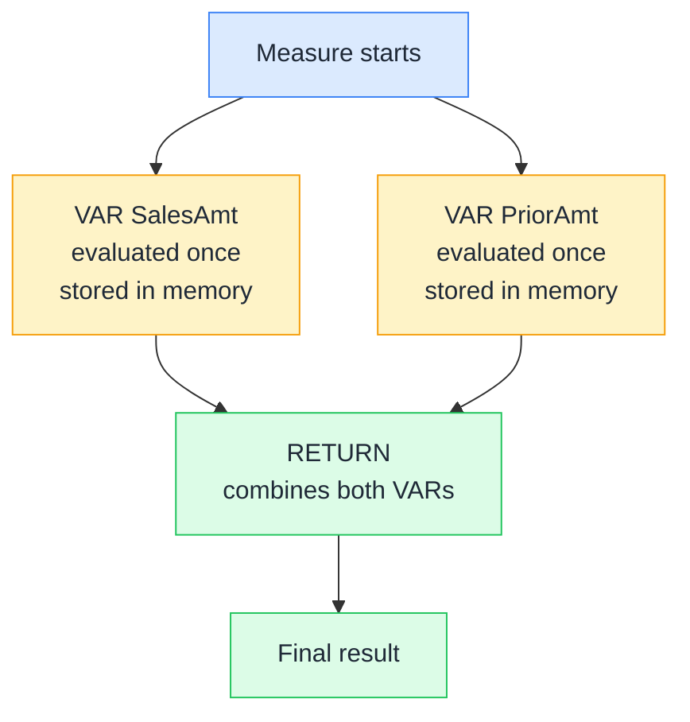

# 📌 VAR / RETURN

> **🧒 Explain Like I'm 5:** Instead of recalculating your gross income four times in a tax return, you write it on a sticky note at the top and just reference the sticky note each time you need it.

## 🖼️ The Picture



Each VAR is computed exactly once. RETURN combines them into the final answer. No repeated evaluation, no risk of inconsistency.

## 🔧 How it actually works

VAR declares a named value that is evaluated once at the point where it's declared. You can reference that variable anywhere later in the same measure — in RETURN or inside another VAR. This eliminates redundant calculations and makes complex measures dramatically more readable.

The scoping rule: a variable captures the filter context at the moment it's declared. This has an important implication — if you declare a VAR inside an iterator like SUMX, it captures the row's context. If you declare it at the top of the measure before any iteration, it captures the outer filter context. Be deliberate about where you place each VAR.

RETURN is the last thing in a VAR block and is mandatory. It's the expression whose result becomes the measure's output. You can reference any previously declared variable in the RETURN expression. Variables are also a debugging lifesaver: you can temporarily replace the RETURN with a single variable name to inspect that intermediate value in the visual.

## 🌍 Real-world example

A year-over-year growth measure without VAR is a mess — you have to write the same `CALCULATE([Sales], SAMEPERIODLASTYEAR('Date'[Date]))` expression twice (once in the numerator logic, once in a denominator check). With VAR, you calculate it once, name it `PriorYear`, and reference it in both places. The measure is half the length and impossible to have inconsistent between the two references.

```dax
YoY Growth % =
VAR CurrentSales = [Total Sales]
VAR PriorSales   = CALCULATE([Total Sales], SAMEPERIODLASTYEAR('Date'[Date]))
RETURN
    DIVIDE(CurrentSales - PriorSales, PriorSales)
```

## 🔗 Related

- [🧮 CALCULATE](calculate.md)
- [📅 TOTALYTD](totalytd.md)
- [📆 SAMEPERIODLASTYEAR](sameperiodlastyear.md)
