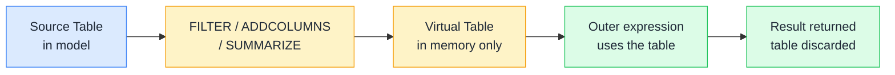

# 🗄️ Virtual Tables

> **🧒 Explain Like I'm 5:** A virtual table is a whiteboard calculation you erase when you're done: you use it to get to the answer, but nothing gets stored permanently.

## 🖼️ The Picture

Virtual tables exist for the lifetime of a single DAX calculation. They're passed as arguments to other functions or used as the table argument in iterators, then they vanish.

## 🔧 How it actually works

DAX functions like FILTER, ADDCOLUMNS, SUMMARIZE, CALCULATETABLE, CROSSJOIN, UNION, and TOPN all return tables, not scalars. These table-valued functions are the building blocks of complex DAX patterns. The tables they return aren't stored anywhere: they live in memory during the evaluation of the outer expression and are discarded when it finishes.

FILTER is the most common: it takes an existing table and a condition, and returns the subset of rows that match. ADDCOLUMNS takes a table and adds one or more new calculated columns to it, useful for pre-computing values before aggregating. SUMMARIZE groups a table by one or more columns and optionally adds summary columns: it's like a SQL GROUP BY.

Virtual tables are especially powerful as the first argument to SUMX or CALCULATE. `SUMX(FILTER(FactSales, FactSales[Discount] > 0.2), FactSales[Amount])` iterates only over rows with a discount greater than 20%, the FILTER virtual table acts as a row filter for the iterator. This avoids modifying the base table and keeps the logic self-contained.

## 🌍 Real-world example

A finance team wants to calculate the revenue from orders where the gross margin exceeds 30%. There's no "high-margin order" flag in the fact table, so they build the filter dynamically: `High Margin Revenue = SUMX(FILTER(FactSales, DIVIDE(FactSales[Profit], FactSales[Revenue]) > 0.3), FactSales[Revenue])`. FILTER creates a virtual table of only the qualifying rows, SUMX iterates it and sums the revenue. The virtual table is never saved to the model: it's built fresh on every query, always reflecting the latest data and the current filter context.

## 🔗 Related

- [➕ SUM vs SUMX](sum-vs-sumx.md)
- [🔝 TOPN](topn.md)
- [🧮 CALCULATE](calculate.md)
