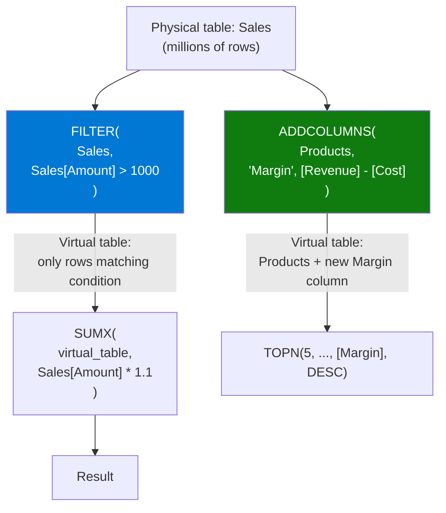

# Virtual Tables

## ELI5

Most DAX functions work with tables that are physically stored in the model. But sometimes you need a table that only exists for the duration of one calculation — like a scratch pad. **Virtual tables** are in-memory tables you construct on the fly using FILTER, ADDCOLUMNS, SUMMARIZE, or SUMMARIZECOLUMNS. They never get stored; they're computed, used, and thrown away.

Think of them as the DAX equivalent of a SQL subquery or a temporary CTE.

## Visual — Virtual table as an intermediate step



## Pattern

```dax
-- FILTER: subset rows from a table
High Value Orders = 
SUMX(
    FILTER(Sales, Sales[Amount] > 1000),
    Sales[Amount]
)

-- ADDCOLUMNS: extend a table with computed columns
-- Creates a virtual table with Products + a Margin column
Weighted Margin = 
SUMX(
    ADDCOLUMNS(
        Products,
        "Margin", [Total Revenue] - [Total Cost]
    ),
    [Margin] * Products[Weight]
)

-- SUMMARIZE: group-by aggregation (returns a table)
-- Best used for grouping; avoid adding aggregation columns to SUMMARIZE
Category Summary = 
SUMMARIZE(
    Sales,
    Products[Category],          -- group by Category
    'Date'[Year]                 -- group by Year
)

-- SUMMARIZECOLUMNS: preferred for grouped aggregations
-- (more efficient than SUMMARIZE + ADDCOLUMNS for measures)
Revenue by Category = 
SUMMARIZECOLUMNS(
    Products[Category],
    "Total Revenue", SUM(Sales[Amount]),
    "Order Count", COUNTROWS(Sales)
)

-- Combine ADDCOLUMNS + FILTER for a filtered ranked table
Top Margin Products = 
FILTER(
    ADDCOLUMNS(
        Products,
        "ProductMargin", [Total Revenue] - [Total Cost]
    ),
    [ProductMargin] > 5000
)

-- VAR pattern: assign a virtual table to a variable for reuse
Complex Calculation = 
VAR SummaryTable = 
    ADDCOLUMNS(
        SUMMARIZE(Sales, Products[Category]),
        "CategorySales", [Total Sales],
        "CategoryRank", RANKX(ALL(Products[Category]), [Total Sales])
    )
VAR TopCategories = FILTER(SummaryTable, [CategoryRank] <= 3)
RETURN SUMX(TopCategories, [CategorySales])
```

## Before / After

| Function | Input | Output |
|----------|-------|--------|
| `FILTER(Sales, Amount > 1000)` | 1,000 rows | ~200 rows matching condition |
| `ADDCOLUMNS(Products, "Margin", ...)` | Products (50 cols) | Products (51 cols, new Margin column) |
| `SUMMARIZE(Sales, Category)` | Sales (1M rows) | Distinct categories (10 rows) |
| `TOPN(3, virtual_table, [Margin], DESC)` | 10-row virtual table | 3-row virtual table |

## Key rules

- **Prefer ADDCOLUMNS + SUMMARIZE over adding measure columns directly to SUMMARIZE** — `SUMMARIZE(table, col, "name", expression)` is deprecated-style and can produce incorrect results with measures; use `ADDCOLUMNS(SUMMARIZE(...), "name", expression)` instead
- **SUMMARIZECOLUMNS is the modern, preferred alternative to SUMMARIZE for reporting aggregations** — it handles blank filtering and is more query-optimizer-friendly
- **Virtual tables are evaluated in the current filter context** — FILTER inside a measure sees the same slicers the measure does; use ALL() in the table argument if you need to escape context
- **Assign complex virtual tables to VAR** — this avoids recomputing the same table multiple times and makes formulas readable
- **Large virtual tables are expensive** — iterating millions of rows with FILTER or ADDCOLUMNS can be slow; consider whether a pre-computed calculated table or a model-level relationship achieves the same result more efficiently
